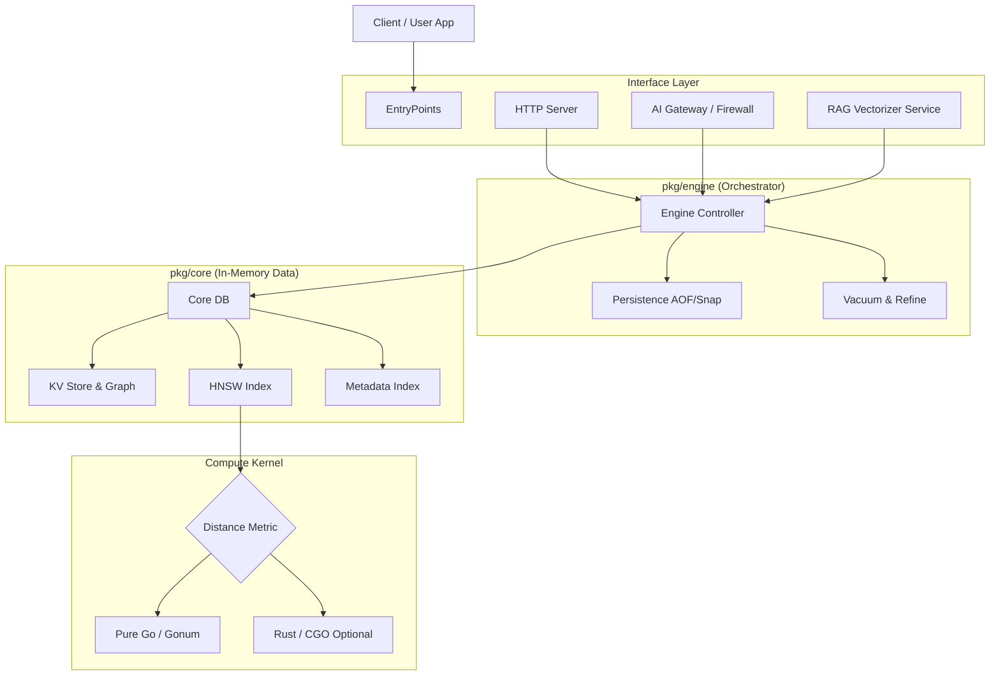

# KektorDB Technical Documentation (v0.4.0)

## Table of Contents

1.  [System Architecture](#1-system-architecture)
2.  [Installation & Deployment](#2-installation--deployment)
3.  [Configuration Guide](#3-configuration-guide)
    *   [Core Server Flags](#31-core-server-flags)
    *   [RAG Pipeline Configuration (`vectorizers.yaml`)](#32-rag-pipeline-configuration-vectorizersyaml)
    *   [AI Gateway Configuration (`proxy.yaml`)](#33-ai-gateway-configuration-proxyyaml)
    *   [Index Maintenance Tuning](#34-index-maintenance-tuning)
4.  [Core Features & Usage](#4-core-features--usage)
    *   [Quantization (Int8 & Float16)](#41-quantization--compression)
    *   [Hybrid Search (BM25 + Vector)](#42-hybrid-search)
    *   [GraphRAG (Automatic Context)](#43-graphrag--context-window)
    *   [Metadata Auto-Linking](#44-metadata-auto-linking)
    *   [Graph Entities](#45-graph-entities-nodes-without-vectors)
    *   [Advanced RAG Pipeline](#46-advanced-rag-pipeline)
    *   [Memory Decay & Reinforcement](#47-memory-decay--reinforcement)
    *   [Embedded Web UI](#48-embedded-web-ui)
5.  [HTTP API Reference](#5-http-api-reference)
    *   [Vector Operations](#51-vector-operations)
    *   [Index Management](#52-index-management)
    *   [Graph Operations](#53-graph-operations)
    *   [Key-Value Store](#54-key-value-store)
    *   [RAG Retrieval](#55-rag-retrieval)
    *   [Model Context Protocol (MCP)](#56-model-context-protocol-mcp)
    *   [System & Maintenance](#57-system--maintenance)
6.  [Go Library Interface](#6-go-library-interface)
7.  [Maintenance & Internals](#7-maintenance--internals)

---

## 1. System Architecture

KektorDB operates as a monolithic, in-memory engine with a modular design. It decouples the data structure logic from the networking and persistence layers.



### Components Breakdown

1.  **Core (`pkg/core`):**
    *   **HNSW Graph:** The primary index for vector similarity.
    *   **Inverted Index:** Maps metadata values (strings) - essentially an inverted index for filtering `category='books'`.
    *   **KV Store:** Holds the raw data, relationship links (`rel:src:type`), and system state.

2.  **Engine (`pkg/engine`):**
    *   **Transaction Coordinator:** Ensures updates are atomic compliant with the AOF persistence.
    *   **Background Tasks:** Manages `Vacuum` (garbage collection) and `Refine` (graph optimization).
    *   **Locking Strategy:** Implements a global lock with parallelized batch commits to maximize throughput while ensuring safety.

3.  **Server (`internal/server`):**
    *   **HTTP Router:** Standard Go `ServeMux`.
    *   **Task Manager:** Handles long-running asynchronous tasks (Imports, Maintenance).
    *   **Modules:** Hosts the *Vectorizer Service* (file watching) and *Proxy* (middleware).

---

## 2. Installation & Deployment

### Standalone Binary
Download from [Releases](https://github.com/sanonone/kektordb/releases).

```bash
# Start with defaults
./kektordb
```

### Docker
The official image is lightweight (~20MB) and based on Alpine.

```bash
docker run -d \
  -p 9091:9091 -p 9092:9092 \
  -v $(pwd)/kektor_data:/data \
  -e KEKTOR_DATA_DIR=/data \
  -e KEKTOR_TOKEN="my-secret-key" \
  sanonone/kektordb:latest
```

---

## 3. Configuration Guide

KektorDB uses a layered configuration approach:
1.  **CLI Flags / Env Vars:** For the core server settings.
2.  **YAML Files:** For the advanced modules (RAG Pipeline and AI Proxy).

### 3.1 Core Server Flags

These control the database engine itself.

| Flag | Env Variable | Default | Description |
| :--- | :--- | :--- | :--- |
| `-http-addr` | `KEKTOR_PORT` | `:9091` | Port for the DB API. |
| `-aof-path` | `KEKTOR_DATA_DIR` | `kektordb.aof` | Path to persistence file. Directory auto-created. |
| `-auth-token` | `KEKTOR_TOKEN` | `""` | If set, enables `Authorization: Bearer <token>` check. |
| `-save` | - | `"60 1000"` | Auto-snapshot policy `"seconds changes"`. Set to `""` to disable. |
| `-aof-rewrite-percentage` | - | `100` | Trigger AOF compaction when file grows by X%. |
| `-mcp` | `KEKTOR_ENABLE_MCP` | `false` | Enables the MCP Memory Server on Standard I/O. |
| `-enable-proxy` | `-KEKTOR_ENABLE_PROXY` | `false` | Enables the AI Gateway/Proxy service on the port specified by -proxy-port. |
| `-proxy-config` | - | `""` | Path to `proxy.yaml`. Enables Proxy if set. |
| `-vectorizers-config` | - | `""` | Path to `vectorizers.yaml`. Enables RAG if set. |

---

### 3.2 RAG Pipeline Configuration (`vectorizers.yaml`)

This file configures the background workers that ingest documents. You can define multiple vectorizers.

**Example:**
```yaml
vectorizers:
  - name: "documentation"
    kektor_index: "knowledge_base"
    schedule: "60s"
    
    source:
      type: "filesystem"
      path: "./docs"
    
    # Optional: Filter files
    include_patterns: ["*.md", "*.pdf"]
    exclude_patterns: ["draft_*", "secret.txt"]

    # Text Splitting Strategy
    document_processor:
      chunking_strategy: "recursive" # Options: recursive, markdown, code, fixed
      chunk_size: 500
      chunk_overlap: 50
    
    # GraphRAG: Automatically link sequential chunks (prev/next)
    graph_enabled: true 

    # Entity Extraction: Uses an LLM to identify concepts and link documents semantically.
    # Connects "islands" of disconnected documents based on shared topics.
    graph_entity_extraction: true

    # LLM Configuration for Extraction (The "Brain")
    llm:
      base_url: "http://localhost:11434/v1"
      model: "qwen2.5:0.5b" # Small model recommended for speed
      temperature: 0.0

    # Embedding Provider (Ollama or OpenAI-compatible)
    embedder:
      type: "ollama_api"
      url: "http://localhost:11434/api/embeddings"
      model: "nomic-embed-text"
      timeout: "120s"

    # Index Creation Settings (Applied if index doesn't exist)
    index_config:
      metric: "cosine"
      precision: "int8"        # Compress vectors to save RAM
      text_language: "english" # Enable BM25 for this language
      
    # Use existing maintenance config or defaults
    maintenance_config:
       vacuum_interval: "5m"

  # You can define multiple vectorizers to watch different folders simultaneously
  - name: "docs_marketing"
    kektor_index: "knowledge_base"
    source: { type: "filesystem", path: "./marketing_pdfs" }
    # ... configuration ...

  - name: "docs_technical"
    kektor_index: "knowledge_base" # Can target the same or different index
    source: { type: "filesystem", path: "./tech_specs" }
    # ... configuration ...

```

#### Key Fields Explained:
*   **`chunking_strategy`**:
    *   `recursive`: Best for general text. Splits by paragraph -> sentence -> word.
    *   `markdown`: Splits by Headers (`#`, `##`).
    *   `code`: Splits by function/class definitions.
*   **`graph_enabled`**: If `true`, KektorDB creates semantic links between chunks. E.g., Chunk 2 is linked to Chunk 1 (`prev`) and Chunk 3 (`next`).
*   **`index_config`**: Allows specifying precision (`int8`, `float16`) and metric (`cosine`, `euclidean`) automatically when the pipeline starts.

---

### 3.3 AI Gateway Configuration (`proxy.yaml`)

This file configures the Middleware that sits between your App/UI and the LLM.

**Example:**
```yaml
port: ":9092"
target_url: "http://localhost:11434" # Where requests are forwarded

# Fast LLM: Used for Query Rewriting (Memory)
fast_llm:
  base_url: "http://localhost:11434/v1"
  model: "qwen2.5:0.5b" 

# Smart LLM: Used for HyDe (Reasoning)
llm:
  base_url: "http://localhost:11434/v1"
  model: "gemma3:4b"

# Embedding setup for analyzing prompts
embedder_type: "ollama_api"
embedder_url: "http://localhost:11434/api/embeddings"
embedder_model: "nomic-embed-text"

# 1. Semantic Firewall
firewall_enabled: true
firewall_index: "prompt_guard"
firewall_threshold: 0.25      # Block if similarity < 0.25
block_message: "I cannot fulfill this request."

# 2. Semantic Cache
cache_enabled: true
cache_index: "semantic_cache"
cache_threshold: 0.1
cache_ttl: "24h"
max_cache_items: 10000

# 3. RAG Injection (Zero-Code RAG)
rag_enabled: true
rag_index: "knowledge_base"   # Must match vectorizer index
rag_top_k: 6
rag_ef_search: 100            # Search breadth (higher = better recall)
rag_threshold: 0.6            # Similarity Score Threshold (0.0-1.0).
                              # Keeps chunks with score >= 0.6. Lower threshold recommended when using HyDe
rag_use_graph: true           # Fetch prev/next chunks automatically
rag_use_hybrid: true          # Use BM25 + Vector for better precision

# Custom Prompts (Optional)
rag_system_prompt: "You are an expert. Answer based on context..."
rag_rewriter_prompt: "Rewrite the last user message to be standalone..."
rag_grounded_hyde_prompt: "Write a hypothetical answer based on these snippets..."
```

#### All Available Options

| Key | Type | Default | Description |
| :--- | :--- | :--- | :--- |
| `port` | string | `:9092` | Listening port for Proxy. |
| `target_url` | string | - | Downstream LLM URL to forward requests to. |
| `cache_ttl` | string | `24h` | Duration to keep cached responses. |
| `cache_delete_threshold` | float | `0.0` | Internal threshold for cache cleanup (advanced). |
| `max_cache_items` | int | `0` (unlimited) | Max items in cache before stopping additions. |
| `rag_hybrid_alpha` | float | `0.5` | Weight for hybrid search (0.0=Text, 1.0=Vector). |
| `rag_threshold` | float | `0.7` | Minimum Similarity Score (0.0-1.0) to include a chunk. Higher is stricter. |
| `rag_ef_search` | int | `100` | Precision of the RAG vector search (HNSW parameter). |
---

### 3.4 Index Maintenance Tuning

KektorDB runs background tasks to keep indexes healthy. You can tune these per-index via API or config.

| Parameter | Type | Default | Description |
| :--- | :--- | :--- | :--- |
| `vacuum_interval` | Duration | `5m` | How often to scan for deleted nodes. |
| `delete_threshold` | Float | `0.1` (10%) | Percentage of "soft deleted" nodes required to trigger vacuum. |
| `refine_enabled` | Bool | `false` | If true, runs graph optimization to improve recall over time. |
| `refine_interval` | Duration | `30m` | Time between refinement cycles. |
| `refine_batch_size` | Int | `500` | Nodes processed per refine cycle. |
| `refine_ef_construction` | Int | `0` | Quality of refinement (0 = uses index default). Higher is slower but better. |
| `graph_vacuum_interval` | Duration | `24h` | Interval between scans for expired graph edges. |
| `graph_retention` | Duration | `0` | How long to keep soft-deleted edges (e.g. "720h"). If 0, history is kept forever (Time Travel). |

---

## 4. Core Features & Usage

### 4.1 Quantization & Compression

KektorDB creates indexes in `float32` by default. You can specify compressed formats to save RAM.

| Precision | Memory Usage | Use Case | Implementation Note |
| :--- | :--- | :--- | :--- |
| **Float32** | 100% | Max Accuracy | Uses AVX/SIMD optimizations. |
| **Float16** | 50% | Vision/Euclidean | Uses `uint16` storage. Faster than F32 on memory-bandwidth bound tasks. |
| **Int8** | 25% | NLP/Cosine | Uses Symmetric Scalar Quantization. Pre-computes norms during insertion. |

**How to use:** Set `"precision": "int8"` in `VCreate` or `vectorizers.yaml`.

### 4.2 Hybrid Search

Hybrid search combines:
1.  **Vector Similarity (Dense):** Understands meaning.
2.  **BM25 (Sparse):** Understands exact keywords.

The scores are normalized and fused using **Weighted Sum**:
`FinalScore = (alpha * VectorScore) + ((1-alpha) * BM25Score)`

### 4.3 GraphRAG & Context Window

KektorDB maintains an **Adjacency List** in its KV store alongside vectors.
When `graph_enabled` is active, sequential chunks are linked.
During search, if you request `hydrate_relations: true`, KektorDB returns the matching chunk **AND** the full text of the previous/next chunks in a single JSON response.

**Self-Repair:** The graph engine includes a self-repair mechanism. If it detects a link to a node that no longer exists (e.g. was deleted), it automatically cleans up the broken link in the background to maintain consistency without impacting query latency.

### 4.4 Metadata Auto-Linking (v0.4.1)
KektorDB can automatically create graph connections between nodes based on metadata fields. This is useful for reconstructing relationships from flat data (e.g., maintaining parent-child hierarchy from SQL foreign keys).

**How it works:**
1.  Define a rule at index creation time: "If a node has metadata field `parent_id`, link it to the node with that ID using relation `child_of`".
2.  When you add a vector with `{"parent_id": "123"}`, KektorDB automatically creates a directional link: `ThisNode -> [child_of] -> Node("123")`.
3.  Best-effort: If the target node doesn't exist yet, the link is created in the forward direction anyway. Incoming links (Reverse Index) will work as soon as the target node is created.

### 4.5 "Graph Entities" (Nodes without Vectors)
Starting from v0.4.1, KektorDB supports **First-Class Graph Entities**. You can insert a node with a `null` vector. 
*   **Use Case:** Represents people, categories, or concepts that you want to link strictly via relationships (e.g. `Author:John`) but don't need to search via vector similarity alongside documents. 
*   **Behavior:** These nodes have a zero-vector [0,0...] internally. They can be retrieved via `SearchNodes` (property filter) or Graph Traversal, but will appear at the "bottom" of vector similarity searches unless the query is also [0,0...].

### 4.6 Advanced RAG Pipeline (v0.4.0)
KektorDB implements a sophisticated "Agentic" retrieval pipeline to solve common RAG issues:

1.  **Query Rewriting (CQR):** Uses a fast LLM to rewrite user questions based on chat history. Solves the "Memory Problem" (e.g., User: "How to install it?" -> System: "How to install KektorDB?").
2.  **Grounded HyDe:** Generates a hypothetical answer to the question using context snippets, then embeds that answer for retrieval. drastically improves recall for vague queries.
3.  **Safety Net:** If HyDe fails to find relevant context, the system automatically falls back to standard vector search in real-time.

### 4.7 Memory Decay & Reinforcement
KektorDB implements a unified memory model where nodes naturally decay in importance if they aren't accessed.
1.  **Memory Decay:** Background workers progressively lower the "rank" or score of nodes based on time elapsed since their last access. This ensures that outdated or stale information naturally sinks to the bottom of semantic searches over time.
2.  **Reinforcement:** Retrieving a memory explicitly "boosts" a node's relevance when it proves useful. For agents, retrieving a memory via RAG acts as reinforcement, fighting off decay and maintaining important context.

### 4.8 Embedded Web UI
A built-in dashboard is available at `http://localhost:9091/ui/`.
*   **Graph Explorer:** Visualize the connections between your documents and entities using a force-directed graph.
*   **Search Debugger:** Test queries and see exactly which chunks and relations are retrieved.
*   **Zero Dependencies:** The UI is embedded in the single binary. No Node.js required.

---

## 5. HTTP API Reference

All endpoints return JSON. Errors are returned as `{"error": "message"}` with appropriate HTTP status codes (4xx/5xx).

### 5.1 Vector Operations

#### Search
**`POST /vector/actions/search`**

Performs a nearest neighbor search. Supports hybrid search, filtering, and Deep Graph Traversal.

**Body:**
```json
{
  "index_name": "docs",
  "k": 10,
  "query_vector": [0.12, -0.5, ...],
  "filter": "category='A'",
  
  // Graph Options
  "include_relations": ["prev", "next", "parent.child"], 
  "hydrate_relations": true,
  
  // Graph Filtering (Topology Restriction)
  "graph_filter": {
    "root_id": "chunk_100",
    "relations": ["next", "parent"],
    "max_depth": 2,
    "direction": "out"
  },

  "alpha": 0.5
}
```
*   `graph_filter`: Restricts the search space to nodes reachable from `root_id` within `max_depth` hops via specified `relations`. Useful for searching only within a specific document or sub-tree.
    *   `direction`: `"out"` (default), `"in"`, or `"both"`.


*   `alpha`: `1.0` = Pure Vector, `0.0` = Pure BM25.
*   `hydrate_relations`: If `true`, returns the full data (Metadata + Vector) of the main results and all related nodes in a nested structure. If false, returns only IDs.
*   `include_relations`: List of relation paths to fetch. Supports Dot Notation for N-Hop traversal (e.g., `"parent.child"` fetches the parent node, then recursively fetches all children of that parent).

#### Add Vectors
**`POST /vector/actions/add`**

Adds or updates a single vector.

**Body:**
```json
{
  "index_name": "docs",
  "id": "doc_1",
  "vector": [0.1, 0.2, ...],
  "metadata": {"title": "Hello", "year": 2024}
}
```

#### Batch Add
**`POST /vector/actions/add-batch`**

*   **Recommended for High Throughput.**
*   Inserts vectors concurrently.
*   Writes to AOF buffer (fast OS-handled I/O).

**Body:**
```json
{
  "index_name": "docs",
  "vectors": [
     {"id": "1", "vector": [...], "metadata": {...}},
     {"id": "2", "vector": [...], "metadata": {...}}
  ]
}
```

#### Bulk Import
**`POST /vector/actions/import`**

*   **Best for:** Backups/Restores where atomicity is key.
*   **Behavior:** Bypasses AOF logging entirely, builds in memory, and forces a full **Snapshot (.kdb)** at the end. Slightly slower than Batch due to snapshot serialization but guarantees a clean state on restart.

**Body:** Same as `add-batch`.

#### Get Vectors
**`POST /vector/actions/get-vectors`**

Retrieves raw vectors and metadata by ID.

**Body:** `{"index_name": "docs", "ids": ["1", "2"]}`

#### Delete Vector
**`POST /vector/actions/delete_vector`**

Soft deletion of a vector.

**Body:** `{"index_name": "docs", "id": "1"}`

#### Compress Index
**`POST /vector/actions/compress`**

Converts an existing index to lower precision (e.g., Float32 -> Int8) to save RAM. Async Task.

**Body:** `{"index_name": "docs", "precision": "int8"}`

---

### 5.2 Index Management

#### List Indexes
**`GET /vector/indexes`**

Returns a list of all active indexes and their stats (size, type, memory usage).

#### Get Index Details
**`GET /vector/indexes/{name}`**

Returns detailed configuration and stats for a specific index.

#### Create Index
**`POST /vector/indexes`** (or `/vector/actions/create`)

Creates a new vector index.

**Body:**
```json
{
  "index_name": "my_index",
  "metric": "cosine",         // cosine, euclidean, dot
  "precision": "int8",        // float32, float16, int8
  "m": 16,                    // HNSW Max connections (default 16)
  "ef_construction": 200,     // HNSW Build accuracy (default 200)
  "text_language": "english", // For BM25
  
  // Optional: Auto-Maintenance Config
  "maintenance": {
     "vacuum_interval": "1m",
     "delete_threshold": 0.2
  },

  // Optional: Metadata Auto-Linking Rules
  "auto_links": [
    {
      "metadata_field": "parent_id", // Field to look for in metadata
      "relation_type": "child_of",   // Relation to create
      "create_node": true            // Placeholder (always true for now)
    }
  ]
}
```

#### Delete Index
**`DELETE /vector/indexes/{name}`**

Permanently removes an index and all associated data.

#### Update Maintenance Config
**`POST /vector/indexes/{name}/config`**

Updates background maintenance settings for an index.

**Body:**
```json
{
  "vacuum_interval": "1h",
  "refine_enabled": true,
  "refine_interval": "2h"
}
```

#### Trigger Maintenance
**`POST /vector/indexes/{name}/maintenance`**

Manually triggers a background maintenance task.

**Body:** `{"type": "vacuum"}` or `{"type": "refine"}`.

> [!TIP]
> **Performance Optimization: "Ingest Fast, Refine Later"**
>
> If you need to index large datasets quickly, create the index with a lower `ef_construction` (e.g., 40). This significantly reduces indexing time. 
> You can then enable the **Refine** process in the background with a higher target quality (e.g., 200). KektorDB will progressively optimize the graph connections in the background while remaining available for queries.

---

### 5.3 Graph Operations

Semantically link ANY two items in the database, regardless of which index they belong to.

#### Link Nodes
**`POST /graph/actions/link`**

Creates a directed edge. Supports weights and properties.

**Body:**
```json
{
  "source_id": "doc_1_chunk_1",
  "target_id": "doc_1_chunk_2",
  "relation_type": "next",
  "inverse_relation_type": "prev", // Optional: Auto-create reverse semantic
  "weight": 0.5,                   // Optional: Defaults to 1.0
  "props": {"type": "direct"}      // Optional: Property Graph attributes
}
```

#### Unlink Nodes
**`POST /graph/actions/unlink`**

Removes or soft-deletes a specific edge.

**Body:**
```json
{
  "source_id": "doc_1",
  "target_id": "doc_2",
  "relation_type": "related",
  "hard_delete": false // Default: false (Soft Delete for Time Travel)
}
```

#### Get Edges (Time Travel)
**`POST /graph/actions/get-edges`**

Retrieves rich edges (weights, props, timestamps). Supports snapshots at a specific point in time.

**Body:**
```json
{
  "source_id": "doc_1",
  "relation_type": "authored",
  "direction": "out",  // "out" (default) or "in"
  "at_time": 170000000 // Optional: Unix Nano. 0 = Now.
}
```

#### Deep Traversal (N-Hop)
**`POST /graph/actions/traverse`**

Performs a recursive graph traversal starting from a specific node ID. This allows retrieving a complex tree of related data in a single request without performing a vector search first.

**Request Body:**
```json
{
  "index_name": "docs",
  "source_id": "chunk_10",
  "paths": [
    "parent",           // 1-Hop: Get the parent document
    "parent.child",     // 2-Hops: Get the parent, then all its children (siblings of chunk_10)
    "next.next"         // 2-Hops: Get the next chunk, and the one after that
  ]
}
```

**Response:** Returns a nested `GraphNode` structure containing the fully hydrated data (Vectors + Metadata) for every node found along the requested paths.

#### Get Incoming Links (Reverse Index)
**`POST /graph/actions/get-incoming`**

Efficiently retrieves "Who points to me?" using the reverse index. This is an O(1) operation.

**Body:**
```json
{
  "target_id": "chunk_2",
  "relation_type": "next"
}
```

**Response:**
```json
{
  "target_id": "chunk_2",
  "relation_type": "next",
  "sources": ["chunk_1"] 
}
```

#### Extract Subgraph (Local Neighborhood)
**`POST /graph/actions/extract-subgraph`**

Extracts the local topology around a Root Node up to a specified depth (BFS). Useful for visualization (UI) or detailed analysis of a specific cluster.
This hydration fetches both metadata and relationships (outgoing and incoming). Supports Time Travel.

**Body:**
```json
{
  "index_name": "docs",
  "root_id": "chunk_5",
  "relations": ["parent", "next"],
  "max_depth": 2,
  "at_time": 0 // 0 = Now
}
```

**Response:**
Returns a `SubgraphResult` containing a list of unique Nodes (hydrated) and all Edges found during exploration.

```json
{
  "root_id": "chunk_5",
  "nodes": [
    {"id": "chunk_5", "metadata": {...}},
    {"id": "doc_1", "metadata": {...}}
  ],
  "edges": [
    {"source": "chunk_5", "target": "doc_1", "relation": "parent", "dir": "out"},
    {"source": "chunk_4", "target": "chunk_5", "relation": "next", "dir": "in"}
  ]
}
```

---

### 5.4 Key-Value Store

Direct access to the underlying KV engine.

*   **GET** `/kv/{key}`
*   **POST/PUT** `/kv/{key}` - Body: `{"value": "some string"}`
*   **DELETE** `/kv/{key}`

---

### 5.5 RAG Retrieval

Abstracted retrieval endpoint for RAG applications.

**`POST /rag/retrieve`**

Uses a configured *Vectorizer Pipeline* to convert text to vectors -> Search -> Return Text.

**Body:**
```json
{
  "pipeline_name": "documentation",
  "query": "How do I configure KektorDB?",
  "k": 3
}
```

---

### 5.6 Model Context Protocol (MCP)

KektorDB implements the [Model Context Protocol](https://modelcontextprotocol.io/) as a **Memory Server**. This allows LLM agents to perform persistent memory operations.

**Activation:**
Run KektorDB with the `--mcp` flag. It will listen for JSON-RPC messages on standard input.

**Available Tools:**

| Tool | Description |
| :--- | :--- |
| `save_memory` | Stores a text chunk with optional tags and graph links. |
| `create_entity` | Creates a named graph entity (e.g., "Project Kektor"). |
| `connect_entities` | Creates a semantic link between two graph nodes. |
| `recall_memory` | Performs a global hybrid search for memories. |
| `scoped_recall` | Performs a semantic search within a specific sub-graph. |
| `explore_connections` | Traverses the knowledge graph to find context for a node. |

**Environment Variables:**
*   `MCP_EMBEDDER_URL`: URL for the embedding service (default: Ollama LOCAL).
*   `MCP_EMBEDDER_MODEL`: Model name for embeddings.

---

### 5.7 System & Maintenance

#### Check Task Status
**`GET /system/tasks/{id}`**

Returns the status of async tasks (Import, Compress, Maintenance).

#### Manual Snapshot
**`POST /system/save`**

Forces a breakdown functionality flush of the entire database to disk (`.kdb` and reset `.aof`).

#### AOF Rewrite
**`POST /system/aof-rewrite`**

Triggers a compaction of the Append-Only File to reclaim disk space.

#### Vectorizer Status
**`GET /system/vectorizers`**

Returns detailed status of all running indexing pipelines (files processed, errors, last run).

#### Trigger Vectorizer
**`POST /system/vectorizers/{name}/trigger`**

Forces a specific vectorizer to run immediately.

#### UI & Visualization
**`POST /ui/search`**
Helper endpoint that converts text to vector (using the server-side embedder) and performs a graph search. Used by the Dashboard.

**`POST /ui/explore`**
Returns a sample of the graph structure (Nodes + Edges) for visualization.
**Body:** `{"index_name": "docs", "limit": 500}`

---

## 6. Go Library Interface

When imported as `github.com/sanonone/kektordb/pkg/engine`:

```go
// 1. Initialize Options
opts := engine.DefaultOptions("./data")
opts.AofRewritePercentage = 200 // Less aggressive rewriting
opts.MaintenanceInterval = 30 * time.Second

// 2. Open Engine
db, err := engine.Open(opts)
if err != nil { panic(err) }
defer db.Close()

// 3. Operations
// Bulk Load
db.VImport("idx", items)

// Search (Note the nil graphFilter parameter)
results, _ := db.VSearch("idx", queryVec, 10, "", 0, 0.5, nil)
```

### Advanced Go Features

#### Metadata Auto-Linking
Create an index that automatically links documents based on metadata fields.

```go
rules := []client.AutoLinkRule{
    {
        MetadataField: "parent_id",
        Relation:      "parent",
    },
}
err := c.VCreateWithAutoLinks("my_index", "cosine", "float32", 16, 200, nil, rules)
```

#### Subgraph Extraction
Retrieve the local topology around a node for visualization or context analysis.

```go
subgraph, err := c.VExtractSubgraph("my_index", "root_node_id", []string{"parent", "next"}, 2)
for _, edge := range subgraph.Edges {
    fmt.Printf("%s --[%s]--> %s (%s)\n", edge.Source, edge.Relation, edge.Target, edge.Dir)
}
```

---

## 7. Maintenance & Internals

### Vacuum (Graph Healing)
In HNSW, a node is more than just a data point; it is a "bridge" for navigation. Simply deleting a node would break paths, potentially making other nodes unreachable. 
*   **Soft Delete**: When you call `VDelete`, the node is flagged but remains in the graph to preserve connectivity.
*   **The Healer**: The Vacuum process identifies these "zombie" nodes, finds all neighboring nodes that point to them, and performs a local search to "re-wire" the graph. 
*   **Memory Recovery**: Once the graph is repaired, the node's vector data is set to `nil`, allowing the Go Garbage Collector to reclaim the memory.

### Graph Vacuum (History Cleanup)
Since the Graph Engine uses **Soft Deletes** to support Time Travel, deleted edges accumulate in the KV store.
*   **Retention Policy**: Configured via `graph_retention`.
*   **Process**: A background task (`RunGraphVacuum`) scans for edges marked as deleted for longer than the retention period and physically removes them.
*   **Default**: Retention is 0 (keep forever).

### Refine (Dynamic Optimization)
Graph quality in HNSW can be sensitive to the order of insertion.
*   **Optimization**: The Refine process cycles through the index, re-evaluating the neighbors of each node. It checks if, given the current state of the database, better neighbors exist than those found at insertion time.
*   **No Blocking**: Refine uses a "yielding" strategy: it processes small batches and releases the global lock between them, ensuring that search QPS remains stable even during heavy optimization.

> **Performance Note:** Starting from v0.4.0, Int8 quantization uses an auto-training mechanism with smart sampling. You can ingest data directly into an `int8` index with zero pre-training delay. Ingestion and Compression are fully parallelized.
