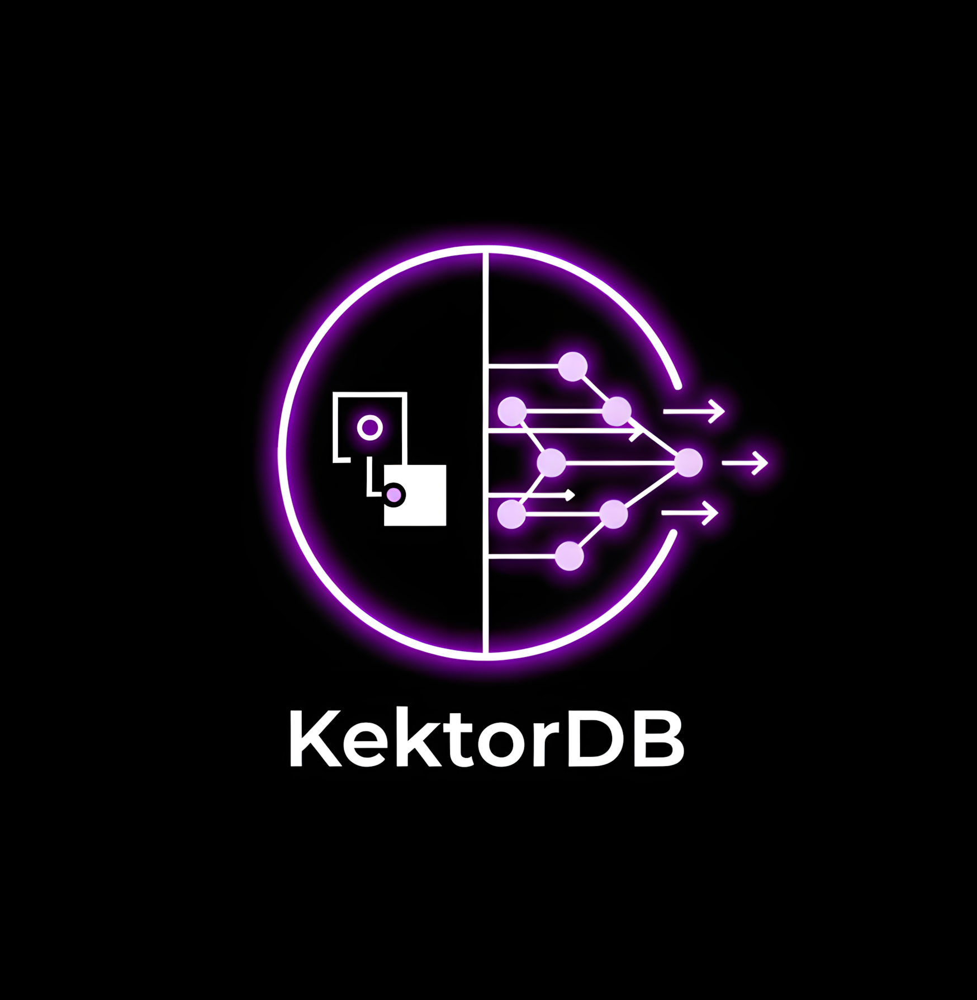
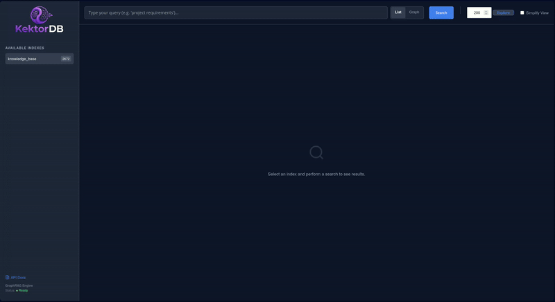
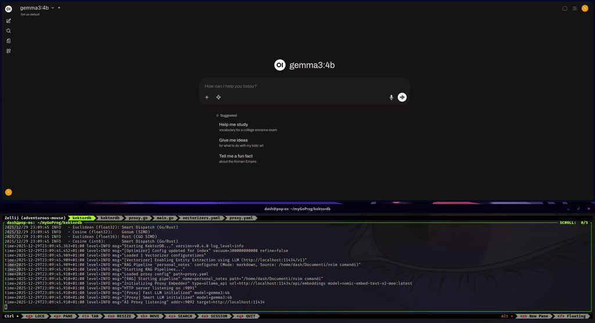
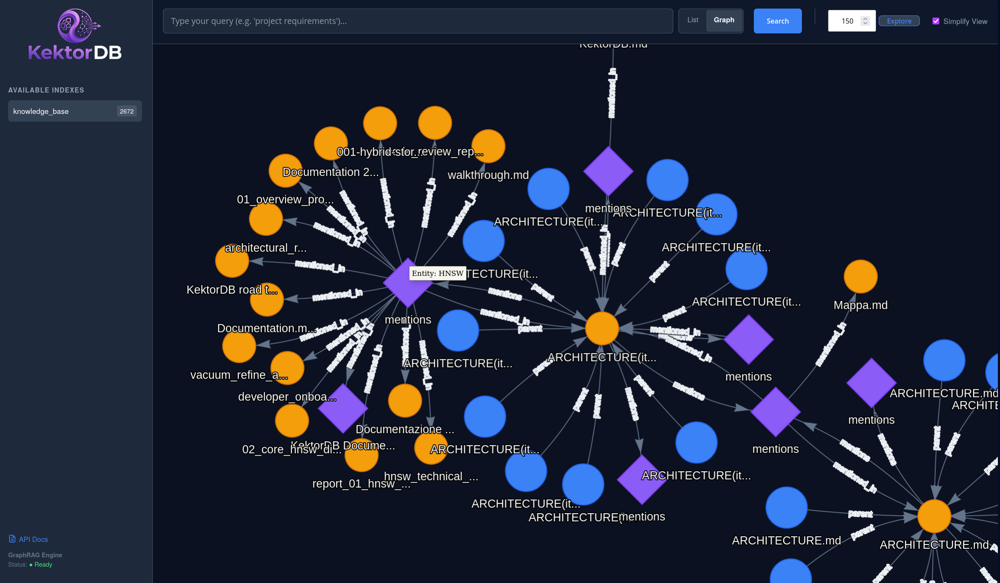

# KektorDB

<p align="center">
  
</p>

[](https://github.com/sponsors/sanonone)
[](https://ko-fi.com/sanon)
[](https://pkg.go.dev/github.com/sanonone/kektordb)
[](https://badge.fury.io/py/kektordb-client)
[](https://opensource.org/licenses/Apache-2.0)

<p align="center">
  <a href="DOCUMENTATION.md">📚 Documentation</a> •
  <a href="CONTRIBUTING.md">🤝 Contributing</a> •
  <a href="docs/guides/zero_code_rag.md">🤖 RAG Open WebUI Guide</a>
</p>

[English](README.md) | [Italiano](README.it.md)

> [!TIP]
> **Supporto Docker:** Preferisci i container? Un `Dockerfile` è incluso nella root per creare le tue immagini.

**KektorDB è un database Vettoriale + Grafo in-memory, integrabile (embeddable) e scritto in puro Go.**

Fonde un solido **Motore HNSW** con un **Grafo Semantico leggero**, permettendoti di combinare la similarità vettoriale con relazioni esplicite (come `parent`, `next`, `mentions`) senza la complessità e l'overhead dei tradizionali Database a Grafo.

> *Costruito con la filosofia di SQLite: opzione serverless, zero dipendenze e facile da gestire.*

<p align="center">
  
</p>

---

## Perché KektorDB?

KektorDB semplifica lo stack unificando il **Database**, il **Motore di Ricerca** e il **Middleware AI** in un singolo binario privo di dipendenze.

*   **Database First:** Uno store robusto e persistente (AOF+Snapshot) con ricerca ibrida (BM25 + Vettore) e filtri sui metadati.
*   **Architettura Embedded:** Progettato per girare a fianco del tuo processo applicativo (come SQLite) o come microservizio leggero, eliminando la latenza di rete.
*   **Livello Grafo Leggero:** A differenza degli store vettoriali "piatti", KektorDB comprende le connessioni. Fornisce un motore a grafo snello, ottimizzato per l'**attraversamento N-Hop** e il **Recupero del Contesto**, colmando il divario tra similarità e struttura.

---

## Casi d'Uso

KektorDB non è progettato per sostituire cluster distribuiti che gestiscono miliardi di vettori. Invece, brilla in scenari specifici e ad alto valore:

### 1. Ricerca Embedded per Applicazioni Go
Ideale per sviluppatori che costruiscono monoliti o microservizi e necessitano di ricerca semantica senza l'overhead operativo di un cluster distribuito.
*   **Scenario:** Implementare "Prodotti Correlati" o "Ricerca Semantica" in un backend Go.
*   **Soluzione:** `import "github.com/sanonone/kektordb/pkg/engine"` per eseguire il DB in-process.
*   **Vantaggio:** Zero complessità di deployment. Il DB scala insieme alla tua app.

### 2. RAG Locale & Knowledge Base
Perfetto per applicazioni desktop, agenti AI locali o ricerca su documentazione privata dove la privacy dei dati è fondamentale.
*   **Scenario:** Devi indicizzare file sensibili (PDF/Markdown/Docx) e chattare con essi usando LLM locali (Ollama).
*   **Soluzione:** Punta KektorDB alla tua cartella. Lui gestisce l'intera pipeline di ingestione (OCR, chunking, linking).
*   **Vantaggio:** Il tempo di setup scende da giorni a minuti. Nessun dato lascia la tua macchina.

### 3. AI Gateway & Cache Semantica
Agisce come un proxy intelligente per ottimizzare costi e latenza delle applicazioni LLM.
*   **Scenario:** Stai costruendo un Chatbot usando API OpenAI/Anthropic.
*   **Soluzione:** Usa KektorDB come middleware. Mette in cache le risposte semanticamente (risparmiando sui costi API) e agisce da firewall per bloccare prompt malevoli prima che raggiungano l'LLM.
*   **Vantaggio:** Miglioramento immediato delle performance e riduzione dei costi senza modificare il codice del client.

---

## RAG Zero-Code (Integrazione Open WebUI)

<p align="center">
  
</p>

KektorDB può funzionare come **middleware intelligente** tra la tua Chat UI e il tuo LLM. Intercetta le richieste, esegue il recupero e inietta il contesto automaticamente.

**Architettura:**
`Open WebUI` -> `KektorDB Proxy (9092)` -> `Ollama / LocalAI (11434)`

**Come configurarlo:**

1.  **Configura `vectorizers.yaml`** per puntare ai tuoi documenti e abilitare l'Estrazione Entità.
2.  **Configura `proxy.yaml`** per puntare al tuo LLM Locale (Ollama) o OpenAI.
3.  **Esegui KektorDB** con il proxy abilitato:
    ```bash
    ./kektordb -vectorizers-config='vectorizers.yaml' -enable-proxy -proxy-config='proxy.yaml'
    ```
4.  **Configura Open WebUI:**
    *   **Base URL:** `http://localhost:9092/v1`
    *   **API Key:** `kektor` (o qualsiasi stringa).
5.  **Chat:** Fai semplicemente domande sui tuoi documenti. KektorDB gestisce il resto.

👉 **[Leggi la Guida Completa: Costruire un Sistema RAG Veloce con Open WebUI](docs/guides/zero_code_rag.md)**

---

## ✨ Caratteristiche Principali

### ⚡ Performance & Ingegneria
*   **Motore HNSW:** Implementazione personalizzata ottimizzata per letture ad alta concorrenza.
*   **Ricerca Ibrida:** Combina Similarità Vettoriale + BM25 (Parole chiave) + Filtri Metadati.
*   **Efficienza della Memoria:** Supporta **Quantizzazione Int8** (75% di risparmio RAM) con auto-training zero-shot e **Float16**.
*   **Manutenzione & Ottimizzazione:**
    *   **Vacuum:** Un processo in background che pulisce i nodi eliminati per recuperare memoria e riparare le connessioni del grafo.
    *   **Refine:** Un'ottimizzazione continua che rivaluta le connessioni del grafo per migliorare la qualità della ricerca (recall) nel tempo.
*   **AI Gateway & Middleware:** Agisce come proxy intelligente per client compatibili con OpenAI/Ollama. Dispone di **Caching Semantico** per servire risposte istantanee a query ricorrenti e un **Firewall Semantico** per bloccare prompt dannosi basandosi sulla similarità vettoriale, indipendentemente dalla pipeline RAG.
*   **Persistenza:** Ibrida **AOF + Snapshot** assicura durabilità.
*   **Osservabilità:** Metriche Prometheus (`/metrics`) e logging strutturato.
*   **Doppia Modalità:** Esegui come **Server REST** autonomo o come **Libreria Go**.

### 🧠 Pipeline RAG Agentica
*   **Riscritura Query (CQR):** Riscrive automaticamente le domande dell'utente basandosi sulla cronologia della chat (es. "Come installarlo?" -> "Come installare KektorDB?"). Risolve problemi di memoria a breve termine.
*   **Grounded HyDe:** Genera risposte ipotetiche per migliorare il recall su query vaghe, usando frammenti di dati reali per ancorare l'allucinazione.
*   **Safety Net:** Ritorna automaticamente alla ricerca vettoriale standard se la pipeline avanzata non riesce a trovare contesto rilevante.

### 🕸️ Motore a Grafo Semantico
*   **Estrazione Entità Automatizzata:** Usa un LLM locale per identificare concetti (Persone, Progetti, Tecnologie) durante l'ingestione e collega documenti correlati ("Unire i puntini").
*   **Attraversamento del Grafo:** La ricerca attraversa i link `prev` (precedente), `next` (successivo), `parent` (genitore) e `mentions` (menziona) per fornire una finestra di contesto olistica.

<p align="center">
  
  <br>
  <em>Visualizzazione delle connessioni semantiche tra documenti tramite entità estratte.</em>
</p>

### 🖥️ Dashboard Integrata
Disponibile su `http://localhost:9091/ui/`.
*   **Graph Explorer:** Visualizza il tuo grafo di conoscenza con un layout force-directed.
*   **Debugger di Ricerca:** Testa le tue query e vedi esattamente perché un documento è stato recuperato.

---

## Installazione

### Come Server (Docker)

```bash
docker run -p 9091:9091 -p 9092:9092 -v $(pwd)/data:/data sanonone/kektordb:latest
```

### Come Server (Binario)
Scarica il binario pre-compilato dalla [Pagina delle Release](https://github.com/sanonone/kektordb/releases).

```bash
# Linux/macOS
./kektordb
```

> **Nota sulla Compatibilità:** Tutto lo sviluppo e i test sono stati eseguiti su **Linux (x86_64)**. Le build pure Go dovrebbero funzionare su Windows/Mac/ARM.

---

## Uso come Libreria Go Integrata

KektorDB può essere importato direttamente nella tua applicazione Go, rimuovendo la necessità di servizi esterni o container.

```bash
go get github.com/sanonone/kektordb
```

```go
package main

import (
	"fmt"
	"github.com/sanonone/kektordb/pkg/core/distance"
	"github.com/sanonone/kektordb/pkg/engine"
)

func main() {
	// 1. Inizializza il Motore (gestisce la persistenza automaticamente)
	opts := engine.DefaultOptions("./kektor_data")
	db, err := engine.Open(opts)
	if err != nil { panic(err) }
	defer db.Close()

	// 2. Crea Indice
	db.VCreate("products", distance.Cosine, 16, 200, distance.Float32, "english", nil)

	// 3. Aggiungi Dati
	db.VAdd("products", "p1", []float32{0.1, 0.2}, map[string]any{"category": "electronics"})

	// 4. Cerca
	results, _ := db.VSearch("products", []float32{0.1, 0.2}, 10, "category=electronics", 100, 0.5)
	fmt.Println("Trovati ID:", results)
}
```

---

### 🚀 Avvio Rapido (Python)

Questo esempio dimostra un flusso di lavoro completo: creazione di un indice, inserimento batch di dati con metadati ed esecuzione di una Ricerca Ibrida (Vettoriale + Parole Chiave).

1.  **Installa Client & Utility:**
    ```bash
    pip install kektordb-client sentence-transformers
    ```

2.  **Esegui lo script:**

    ```python
    from kektordb_client import KektorDBClient
    from sentence_transformers import SentenceTransformer

    # 1. Inizializzazione
    client = KektorDBClient(port=9091)
    model = SentenceTransformer('all-MiniLM-L6-v2') 
    index = "quickstart"

    # 2. Crea Indice (Ibrido abilitato)
    try: client.delete_index(index)
    except: pass
    client.vcreate(index, metric="cosine", text_language="english")

    # 3. Aggiungi Dati (Batch)
    docs = [
        {"text": "Go is efficient for backend systems.", "type": "code"},
        {"text": "Rust guarantees memory safety.", "type": "code"},
        {"text": "Pizza margherita is classic Italian food.", "type": "food"},
    ]
    
    batch = []
    for i, doc in enumerate(docs):
        batch.append({
            "id": f"doc_{i}",
            "vector": model.encode(doc["text"]).tolist(),
            "metadata": {"content": doc["text"], "category": doc["type"]}
        })
    
    client.vadd_batch(index, batch)
    print(f"Indicizzati {len(batch)} documenti.")

    # 4. Cerca (Ibrido: Vettore + Filtro Metadati)
    # Trovare "fast programming languages" MA solo nella categoria 'code'
    query_vec = model.encode("fast programming languages").tolist()
    
    results = client.vsearch(
        index,
        query_vector=query_vec,
        k=2,
        filter_str="category='code'", # Filtro Metadati
        alpha=0.7 # 70% Sim. Vettoriale, 30% Rank Parole Chiave
    )

    print(f"ID Risultato Top: {results[0]}")
    ```

---

### 🦜 Integrazione con LangChain

KektorDB include un wrapper integrato per **LangChain Python**, permettendoti di collegarlo direttamente alle tue pipeline AI esistenti.

```python
from kektordb_client.langchain import KektorVectorStore
```

---

## Benchmark Preliminari

I benchmark sono stati eseguiti su una macchina Linux locale (Hardware Consumer, Intel i5-12500). Il confronto avviene contro **Qdrant** e **ChromaDB** (via Docker con host networking) per garantire una base di riferimento equa.

> **Avvertenza:** Il benchmarking dei database è complesso. Questi risultati riflettono uno scenario specifico (**nodo singolo, heavy-read, client Python**) sulla mia macchina di sviluppo. Sono intesi per dimostrare le capacità di KektorDB come motore integrato ad alte prestazioni, non per rivendicare superiorità assoluta in scenari di produzione distribuiti.

#### 1. Carico di Lavoro NLP (GloVe-100d, Cosine)
*400k vettori, precisione float32.*
KektorDB sfrutta Go Assembly (Gonum) ottimizzato per la similarità del Coseno. In questo setup specifico, mostra un throughput molto elevato.

| Database | Recall@10 | **QPS (Query/sec)** | Tempo Indicizzazione (s) |
| :--- | :--- | :--- | :--- |
| **KektorDB** | 0.9664 | **1073** | 102.9s |
| Qdrant | 0.9695 | 848 | **32.3s** |
| ChromaDB | 0.9519 | 802 | 51.5s |

#### 2. Carico di Lavoro Computer Vision (SIFT-1M, Euclidean)
*1 Milione di vettori, precisione float32.*
KektorDB usa un motore ibrido Go/Rust (`-tags rust`) per questo test. Nonostante l'overhead di CGO per vettori da 128d, le prestazioni sono competitive con i motori nativi C++/Rust.

| Database | Recall@10 | **QPS (Query/sec)** | Tempo Indicizzazione (s) |
| :--- | :--- | :--- | :--- |
| **KektorDB** | 0.9906 | **881** | 481.4s |
| Qdrant | 0.998 | 845 | **88.5s** |
| ChromaDB | 0.9956 | 735 | 211.2s |

> *Nota sulla Velocità di Indicizzazione:* KektorDB è attualmente più lento nell'ingestione rispetto a motori maturi. Questo è in parte dovuto al fatto che costruisce il grafo completamente interrogabile immediatamente all'inserimento, ma soprattutto a causa dell'attuale architettura a grafo singolo. **Ottimizzare la velocità di ingestione massiva (bulk) è la priorità assoluta per la prossima major release.**

> [!TIP]
> **Ottimizzazione Prestazioni: "Ingest Fast, Refine Later"**
>
> Se devi indicizzare grandi dataset velocemente, crea l'indice con un `ef_construction` più basso (es. 40). Questo riduce significativamente il tempo di indicizzazione.
> Puoi poi abilitare il processo di **Refine** in background con una qualità target più alta (es. 200). KektorDB ottimizzerà progressivamente le connessioni del grafo in background rimanendo disponibile per le query.

#### Efficienza della Memoria (Compressione & Quantizzazione)
KektorDB offre risparmi di memoria significativi attraverso quantizzazione e compressione, permettendoti di far stare dataset più grandi in RAM con un impatto minimo su prestazioni o recall.

| Scenario | Config | Impatto Memoria | QPS | Recall |
| :--- | :--- | :--- | :--- | :--- |
| **NLP (GloVe-100d)** | Float32 | 100% (Base) | ~1073 | 0.9664 |
| | **Int8** | **~25%** | ~858 | 0.905 |
| **Vision (SIFT-1M)** | Float32 | 100% (Base) | ~881 | 0.9906 |
| | **Float16** | **~50%** | ~834 | 0.9770 |

*(La logica "Smart Dispatch" nella build accelerata con Rust seleziona automaticamente la migliore implementazione—Go, Gonum, o Rust—per ogni operazione basandosi sulle dimensioni del vettore. Le versioni in puro Go `float16` e `int8` servono come fallback portatili.)*

[Report Completo dei Benchmark](BENCHMARKS.md)

---

## Riferimento API (Sommario)

Per una guida completa a tutte le funzionalità e agli endpoint API, consulta la **[Documentazione Completa](DOCUMENTATION.md)**.

*   `POST /vector/actions/search`: Ricerca vettoriale ibrida.
*   `POST /vector/actions/import`: Caricamento massivo ad alta velocità.
*   `POST /vector/indexes`: Crea e gestisci indici.
*   `POST /graph/actions/link`: Crea relazioni semantiche.
*   `POST /graph/actions/traverse`: Attraversamento profondo del grafo (N-Hop) partendo da un ID nodo specifico.
*   `POST /rag/retrieve`: Ottieni chunk di testo per RAG.
*   `GET /system/tasks/{id}`: Monitora task a lunga esecuzione.
*   `POST /system/save`: Snapshot manuale.

---

## 🛣️ Roadmap

KektorDB è un progetto giovane in sviluppo attivo.

### Prossimamente (v0.5.0) - L'Aggiornamento Scalabilità & Integrità
Il prossimo importante traguardo si concentra sul superamento del limite della RAM e sul miglioramento delle garanzie di coerenza dei dati.
*   [ ] **Storage Ibrido su Disco:** Implementazione di un motore di storage "pluggable". Mantiene il grafo HNSW in RAM (o Int8) per la velocità, ma sposta i dati vettoriali completi su disco utilizzando I/O standard o memory mapping.
*   [ ] **Integrità Transazionale del Grafo:** Introduzione di **Batch Atomici** per garantire la consistenza dei dati durante la creazione di link bidirezionali o l'aggiornamento dei vettori (comportamento simil-ACID per il livello Grafo).
*   [ ] **Reverse Indexing:** Gestione automatica degli archi in entrata per consentire il recupero O(1) di "chi punta al nodo X", essenziale per l'attraversamento efficiente del grafo e la pulizia.
*   [ ] **Backup/Restore Nativo:** API semplice per salvare snapshot su S3/MinIO/Locale senza dover fermare il server.

### Pianificati (Breve Termine)
Funzionalità che intendo sviluppare per rendere KektorDB pronto per la produzione e ancora più veloce.
*   [ ] **Filtri sul Grafo:** Combinare la ricerca vettoriale con filtri sulla topologia del grafo (es. "cerca solo nei figli del Documento X"), potenziato dai Roaring Bitmaps.
*   [ ] **Relazioni RAG Configurabili:** Permettere agli utenti di definire percorsi di attraversamento del grafo personalizzati nel `proxy.yaml` invece di affidarsi ai default hardcodati.
*   [ ] **Ottimizzazioni SIMD/AVX:** Estendere le ottimizzazioni Assembly Go puro (attualmente usate per il Coseno) alla distanza Euclidea e alle operazioni Float16 per massimizzare il throughput sulle CPU moderne.
*   [ ] **Roaring Bitmaps:** Sostituire l'attuale filtro basato su mappe con Roaring Bitmaps per filtri sui metadati ultra-veloci (es. `WHERE user_id = X`).
*   [ ] **RBAC & Sicurezza:** Implementare il controllo accessi basato sui ruoli (Admin vs Read-Only) e una granularità più fine per applicazioni multi-tenant.
*   [ ] **Client TypeScript Ufficiale:** Per supportare meglio l'ecosistema AI JS/Node.js.

### Visione Futura (Lungo Termine)
Funzionalità in fase di ricerca. La loro implementazione dipende dall'adozione nel mondo reale, dal feedback e dal tempo di sviluppo disponibile.
*   **Property Graphs:** Supporto per "Rich Edges" con attributi (pesi, timestamp) per abilitare algoritmi di raccomandazione complessi.
*   **Replicazione Distribuita:** Consenso basato su Raft per l'Alta Disponibilità (Leader-Follower).
*   **Semantic "Gardener:** Un processo in background che usa gli LLM per unire chunk duplicati e risolvere conflitti nel Knowledge Graph automaticamente.

> **Vuoi influenzare la roadmap?** [Apri una Issue](https://github.com/sanonone/kektordb/issues) o vota quelle esistenti!

---

## 🛑 Limitazioni attuali (v0.4.0)
* **Singolo nodo:** KektorDB attualmente non supporta il clustering. Scala verticalmente entro i limiti delle risorse della macchina.
* **Limite RAM:** Fino alla v0.5.0 (archiviazione su disco), il set di dati deve essere contenuto nella RAM.
* **Software beta:** Sebbene stabili per uso personale, le API potrebbero evolversi.

---

### ⚠️ Stato del Progetto e Filosofia

Sebbene l'ambizione sia alta, la velocità di sviluppo dipende dal tempo libero disponibile e dai contributi della community. La roadmap rappresenta la **visione** tecnica, ma le priorità potrebbero cambiare in base al feedback degli utenti e alle necessità di stabilità.

Se ti piace la visione e vuoi accelerare il processo, le **Pull Request sono le benvenute!**

---

## 🤝 Contribuire

**KektorDB è un progetto personale nato dal desiderio di imparare.**

Come unico manutentore, ho costruito questo motore per esplorare CGO, SIMD e ottimizzazioni Go a basso livello. Sono orgoglioso delle prestazioni raggiunte finora, ma so che c'è sempre un modo migliore per scrivere codice.

Se noti race conditions, ottimizzazioni mancate o pattern Go non idiomatici, **per favore apri una Issue o una PR**.

👉 **[Per saperne di più](CONTRIBUTING.md)**

---

### Licenza

Distribuito sotto Licenza Apache 2.0. Vedi il file `LICENSE` per i dettagli.

---

## ☕ Supporta il Progetto

Se trovi questo strumento utile per il tuo setup RAG locale o le tue applicazioni Go, per favore considera di supportare lo sviluppo.

Il tuo supporto mi aiuta a dedicare più tempo alla manutenzione, a nuove funzionalità e alla documentazione.

<a href="https://ko-fi.com/sanon">
  
</a>
