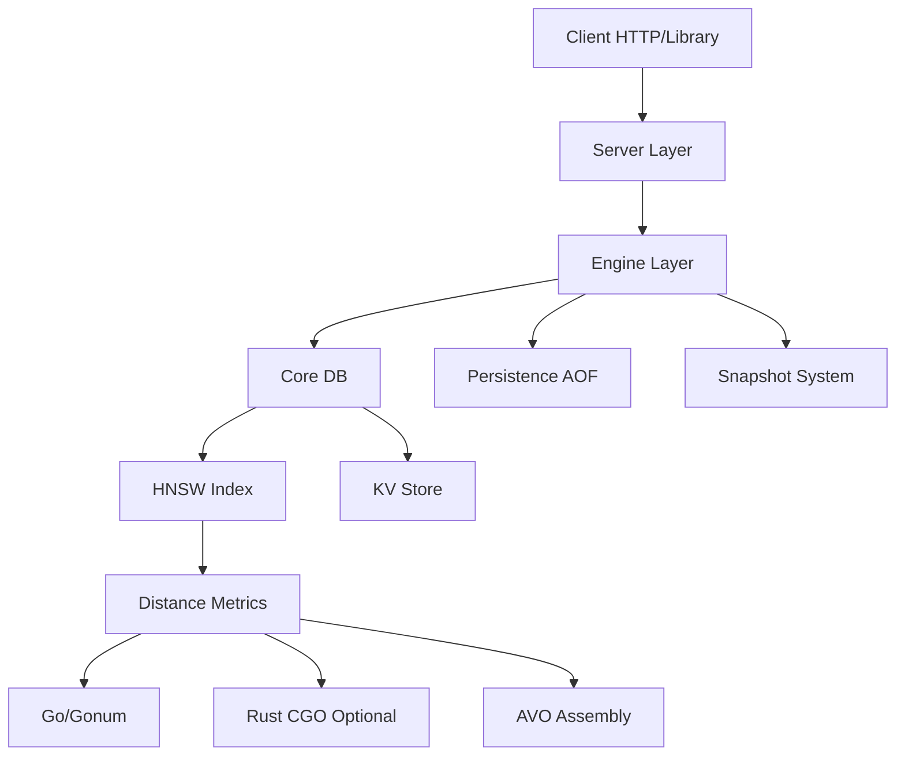

# KektorDB 

<p align="center">
  
</p>

[](https://pkg.go.dev/github.com/sanonone/kektordb)
[](https://badge.fury.io/py/kektordb-client)
[](https://opensource.org/licenses/Apache-2.0)

[English](README.md) | [Italiano](README.it.md)

> [!TIP]
> **Supporto Docker:** Preferisci i container? Un `Dockerfile` è incluso nella root per costruire le tue immagini.

**KektorDB è un database vettoriale e Key-Value in-memory scritto in Go. Implementa un motore HNSW per la ricerca vettoriale, ricerca ibrida con ranking BM25, filtri sui metadati e un'API REST basata su JSON.**

### Motivazione e Filosofia

Questo progetto è nato come percorso di apprendimento personale per approfondire le logiche interne dei database. L'obiettivo era costruire un motore di ricerca **autonomo e privo di dipendenze esterne**, puntando alla semplicità architetturale del **"SQLite dei Vector DB"**.

KektorDB può essere eseguito come server standalone o importato come libreria Go integrabile (`pkg/engine`), offrendo una soluzione flessibile per gli sviluppatori che necessitano di ricerca vettoriale locale senza dover gestire infrastrutture complesse.

---

### ✨ Funzionalità Principali

*   **Motore HNSW Personalizzato:** Implementazione da zero dell'algoritmo HNSW con euristica di selezione dei vicini per garantire la qualità del grafo.
*   **Motore di Ricerca Ibrido:**
    *   **Full-Text Search:** Analisi del testo integrata (tokenizzazione/stemming per Inglese e Italiano) e indice invertito.
    *   **Ranking BM25:** I risultati testuali sono ordinati per rilevanza usando l'algoritmo standard BM25.
    *   **Score Fusion:** Combina i punteggi vettoriali e testuali tramite un parametro `alpha` configurabile.
*   **Sincronizzazione Automatica (Vectorizer):** Un servizio in background che monitora sorgenti dati (es. directory del filesystem), genera embedding tramite API esterne (come Ollama) e aggiorna l'indice automaticamente.
*   **Filtri sui Metadati:** Supporto per il pre-filtraggio sui metadati tramite uguaglianza, range (`price < 100`) e logica booleana (`AND`/`OR`).
*   **Compressione Vettoriale:**
    *   **Float16:** Riduce la dimensione degli indici Euclidei del **50%**.
    *   **Int8:** Quantizza gli indici Coseno del **75%**.
*   **API:**
    *   API REST JSON con supporto per operazioni batch e gestione task asincroni.
    *   Client ufficiali per **Python** e **Go**.
*   **Persistenza:** Un sistema ibrido **AOF + Snapshot** garantisce la durabilità dei dati tra i riavvii.
*   **Manutenzione & Ottimizzazione:**
    *   **Vacuum:** Un processo in background che ripulisce i nodi cancellati per recuperare memoria e riparare le connessioni del grafo.
    *   **Refine:** Un ottimizzatore continuo che rivaluta le connessioni del grafo per migliorare la qualità della ricerca (recall) nel tempo.
*   **Doppio Motore di Calcolo:**
    *   **Standard Build:** Usa Go puro con assembly `gonum` per la massima portabilità.
    *   **Performance Build:** Build opzionale (`-tags rust`) che linka una libreria Rust tramite CGO per sfruttare istruzioni SIMD specifiche.

---

### Architettura 

1.  **Core (`pkg/core`):** Contiene le strutture dati grezze in memoria (grafo HNSW, archivio KV, indice invertito). Gestisce la logica dei dati ma non è a conoscenza del file system o della rete.
2.  **Engine (`pkg/engine`):** Gestisce il Core, gestisce la persistenza dei dati (scrittura/riproduzione AOF, snapshot) e coordina le attività di manutenzione in background. Questo è il punto di ingresso per l'utilizzo embedded.
3.  **Server (`internal/server`):** Un wrapper HTTP attorno all'Engine. Fornisce l'API REST, i worker in background di Vectorizer e la gestione delle attività.



---

### Benchmark Preliminari

I benchmark sono stati eseguiti su una macchina Linux locale (Hardware Consumer, Intel i5-12500). Il confronto è stato fatto con **Qdrant** e **ChromaDB** (via Docker con host networking) per garantire una base equa.

> **⚠️ Disclaimer Onesto:** Fare benchmark corretti sui database è notoriamente difficile. Sebbene abbia fatto ogni sforzo per configurare i motori equamente (es. rimuovendo l'overhead di rete), non sono un esperto nella configurazione di Qdrant o ChromaDB e potrei aver perso delle ottimizzazioni. Considerate questi numeri come un **indicatore direzionale** del potenziale di KektorDB in uno scenario specifico (single-node, read-heavy), piuttosto che una conclusione scientifica definitiva.

#### 1. NLP Workload (GloVe-100d, Cosine)
*400k vettori, precisione float32.*
KektorDB sfrutta l'Assembly Go ottimizzato (Gonum) per la similarità del Coseno. In questo setup specifico, mostra un throughput molto elevato.

| Database | Recall@10 | **QPS (Queries/sec)** | Indexing Time (s) |
| :--- | :--- | :--- | :--- |
| **KektorDB** | 0.971 | **974** | 127s |
| Qdrant | 0.970 | 807 | **34s** |
| ChromaDB | 0.955 | 761 | 53s |

#### 2. Computer Vision Workload (SIFT-1M, Euclidean)
*1 Milione di vettori, precisione float32.*
KektorDB usa il motore ibrido Go/Rust (`-tags rust`) per questo test. Nonostante l'overhead di CGO per i vettori 128d, le prestazioni sono competitive con i motori nativi C++/Rust.

| Database | Recall@10 | **QPS (Queries/sec)** | Indexing Time (s) |
| :--- | :--- | :--- | :--- |
| **KektorDB** | 0.990 | 753 | 634s |
| Qdrant | 0.998 | **852** | **89s** |
| ChromaDB | 0.994 | 752 | 210s |

> *Nota sulla Velocità di Indexing:* KektorDB è attualmente più lento nell'ingestione rispetto ai motori maturi. Questo è dovuto in parte al fatto che costruisce il grafo interrogabile completo immediatamente all'inserimento, ma soprattutto all'attuale architettura a grafo singolo. **Ottimizzare l'ingestione massiva è la priorità assoluta per la prossima major release.**

#### Efficienza della Memoria (Compressione & Quantizzazione)
KektorDB offre un risparmio di memoria significativo tramite quantizzazione e compressione, permettendo di caricare dataset più grandi in RAM con impatto minimo su prestazioni o recall.

| Scenario | Config | Impatto Memoria | QPS | Recall |
| :--- | :--- | :--- | :--- | :--- |
| **NLP (GloVe-100d)** | Float32 | 100% (Baseline) | ~974 | 0.971 |
| | **Int8** | **~25%** | ~767 | 0.908 |
| **Vision (SIFT-1M)** | Float32 | 100% (Baseline) | ~753 | 0.990 |
| | **Float16** | **~50%** | **~785** | 0.980 |

*(La logica di "Smart Dispatch" nella build accelerata con Rust seleziona automaticamente l'implementazione migliore—Go, Gonum o Rust—per ogni operazione in base alle dimensioni del vettore. Le versioni pure Go `float16` e `int8` fungono da fallback portatili.)*

[Vedi i Benchmark Dettagliati](BENCHMARKS.md)

---

### Installazione

Scarica il binario pre-compilato dalla pagina delle [Releases](https://github.com/sanonone/kektordb/releases).

```bash
# Linux/macOS
./kektordb
```

> **Nota di Compatibilità:** Tutto lo sviluppo e i test sono stati eseguiti su **Linux (x86_64)**.
> *   **Build Go Puro:** Dovrebbero funzionare senza problemi su Windows, macOS (Intel/M1) e ARM, sebbene non verificate manualmente.
> *   **Build Accelerate Rust:** Sfruttano CGO e istruzioni SIMD specifiche. Queste build sono state verificate **solo su Linux**.

### Use Case & Quando Usarlo

KektorDB segue la "filosofia SQLite" ma per i vettori. Non è progettato per sostituire cluster distribuiti (come Qdrant Cloud o Milvus) per dati su scala petabyte.

**✅ Usa KektorDB quando:**
*   Hai bisogno di un motore di ricerca **locale ed embedded** per un'applicazione Go o Python.
*   Vuoi mantenere l'architettura semplice (nessun container/servizio extra richiesto).
*   Il tuo dataset sta nella RAM (es. < 5M vettori su un server standard).
*   Stai costruendo applicazioni "Edge AI" o privacy-first dove i dati non devono lasciare la macchina.

**❌ Considera altre opzioni quando:**
*   Hai bisogno di storage distribuito su più nodi (Sharding/Replication).
*   Il tuo dataset è massivo (100M+ vettori) e richiede indici su disco.

### 🦜 Integrazione con LangChain

KektorDB include un wrapper integrato per **LangChain Python**, permettendoti di inserirlo direttamente nelle tue pipeline AI esistenti.

```python
from kektordb_client.langchain import KektorVectorStore
# Vedi clients/python/README.md per i dettagli completi
```

### 🚀 Quick Start (Python)

Questo esempio mostra un flusso completo: creazione di indici, inserimento batch di dati con metadati e ricerca ibrida.

1.  **Avvia il Server KektorDB:**
    ```bash
    ./kektordb -http-addr=":9091"
    ```

2.  **Installa il Client Python:**
    ```bash
    pip install kektordb-client sentence-transformers
    ```

3.  **Usa KektorDB nel tuo script Python:**

    ```python
    from kektordb_client import KektorDBClient, APIError
    from sentence_transformers import SentenceTransformer

    # 1. Inizializza client e modello
    client = KektorDBClient(port=9091)
    model = SentenceTransformer('all-MiniLM-L6-v2') 
    index_name = "quickstart_index"

    # 2. Crea un indice pulito
    try:
        client.delete_index(index_name)
        print(f"Rimosso vecchio indice '{index_name}'.")
    except APIError:
        pass 

    client.vcreate(
        index_name, 
        metric="cosine", 
        text_language="english"
    )
    print(f"Indice '{index_name}' creato.")
    
    # 3. Prepara e indicizza documenti
    documents = [
        {"id": "doc_go", "text": "Go is a language designed at Google for efficient software.", "year": 2012},
        {"id": "doc_rust", "text": "Rust is a language focused on safety and concurrency.", "year": 2015},
        {"id": "doc_python", "text": "Python is a high-level, general-purpose programming language.", "year": 1991},
    ]
    
    batch_payload = []
    for doc in documents:
        batch_payload.append({
            "id": doc["id"],
            "vector": model.encode(doc["text"]).tolist(),
            "metadata": {"content": doc["text"], "year": doc["year"]}
        })
    client.vadd_batch(index_name, batch_payload)
    print(f"{len(batch_payload)} documenti indicizzati.")
    
    # 4. Esegui ricerca ibrida
    query = "a safe and concurrent language"
    print(f"\nRicerca per: '{query}'")

    results = client.vsearch(
        index_name=index_name,
        k=1,
        query_vector=model.encode(query).tolist(),
        # Trova documenti con "language" ma solo dopo il 2010
        filter_str='CONTAINS(content, "language") AND year > 2010',
        alpha=0.7 
    )

    print(f"Risultati trovati: {results}")
    ```
**Nota per utenti macOS:** I binari pre-compilati per macOS usano il motore di calcolo Go puro per massima compatibilità. Per casi d'uso critici che richiedono accelerazione SIMD, raccomandiamo di compilare localmente: `make build-rust-native && go build -tags rust ./cmd/kektordb`.

---

### Utilizzo come Libreria Go (Embedded)

Uno degli obiettivi principali di KektorDB è la facilità di integrazione. Puoi importare l'engine direttamente nella tua applicazione Go, eliminando la necessità di servizi esterni o container.

```bash
go get github.com/sanonone/kektordb
```

```go
package main

import (
	"fmt"
	"github.com/sanonone/kektordb/pkg/core/distance"
	"github.com/sanonone/kektordb/pkg/engine"
)

func main() {
	// 1. Inizializza l'Engine (gestisce la persistenza automaticamente)
	opts := engine.DefaultOptions("./kektor_data")
	db, err := engine.Open(opts)
	if err != nil { panic(err) }
	defer db.Close()

	// 2. Crea Indice
	db.VCreate("products", distance.Cosine, 16, 200, distance.Float32, "english")

	// 3. Aggiungi Dati
	db.VAdd("products", "p1", []float32{0.1, 0.2}, map[string]any{"category": "electronics"})

	// 4. Cerca
	results, _ := db.VSearch("products", []float32{0.1, 0.2}, 10, "category=electronics", 100, 0.5)
	fmt.Println("ID Trovati:", results)
}
```
---

### Riferimento API

#### Key-Value Store
- `GET /kv/{key}`: Recupera un valore.
- `POST /kv/{key}`: Imposta un valore. Body: `{"value": "..."}`.
- `DELETE /kv/{key}`: Elimina una chiave.

#### Gestione Indici
- `GET /vector/indexes`: Elenca tutti gli indici.
- `GET /vector/indexes/{name}`: Ottiene dettagli per un singolo indice.
- `DELETE /vector/indexes/{name}`: Elimina un indice.

#### Azioni Vettoriali (RPC-Style)
- `POST /vector/actions/create`: Crea un nuovo indice vettoriale.
  - Body: `{"index_name": "...", "metric": "...", "precision": "...", "text_language": "...", "m": ..., "ef_construction": ...}`
- `POST /vector/actions/add`: Aggiunge un singolo vettore.
  - Body: `{"index_name": "...", "id": "...", "vector": [...], "metadata": {...}}`
- `POST /vector/actions/add-batch`: Aggiunge più vettori.
  - Body: `{"index_name": "...", "vectors": [{"id": ..., "vector": ...}, ...]}`
- `POST /vector/actions/import`: Caricamento massivo ad alta velocità (bypassa AOF).
  - Body: `{"index_name": "...", "vectors": [...]}`
- `POST /vector/actions/search`: Esegue una ricerca vettoriale ibrida.
  - Body: `{"index_name": "...", "k": ..., "query_vector": [...], "filter": "...", "ef_search": ..., "alpha": ...}`
- `POST /vector/actions/delete_vector`: Elimina un singolo vettore.
  - Body: `{"index_name": "...", "id": "..."}`
- `POST /vector/actions/get-vectors`: Recupera dati per più vettori per ID.
  - Body: `{"index_name": "...", "ids": ["...", "..."]}`
- `POST /vector/actions/compress`: Comprime asincronamente un indice.
  - Body: `{"index_name": "...", "precision": "..."}`

#### Recupero Dati
- `GET /vector/indexes/{name}/vectors/{id}`: Recupera dati per un singolo vettore.

#### Sistema
- `POST /system/save`: Attiva uno snapshot del database.
- `POST /system/aof-rewrite`: Attiva una compattazione AOF asincrona.
- `GET /system/tasks/{id}`: Ottiene lo stato di una task asincrona.
- `GET /debug/pprof/*`: Espone endpoint di profilazione Go pprof.

---

### Documentazione

Per una guida completa a tutte le funzionalità e endpoint API, consulta la **[Documentazione Completa](https://github.com/sanonone/kektordb/blob/main/DOCUMENTATION.md)**.

---

### 🛣️ Roadmap & Lavoro Futuro

KektorDB è in sviluppo attivo. La roadmap è divisa in priorità a breve termine per la prossima major release e ambizioni a lungo termine.

#### **Obiettivi a Breve Termine**

Queste sono le funzionalità e i miglioramenti di priorità più alta pianificati per le prossime release:

*   **Advanced Filtering:** Sostituire le mappe Go con **Roaring Bitmaps** per filtri ultra-veloci e minor consumo di memoria.
*   **Graph Healing:** Implementare un worker per riparare il grafo HNSW dopo le cancellazioni ("Vacuum"), garantendo la qualità dell'indice nel tempo.
*   **Native Snapshotting:** Ottimizzare il formato snapshot (serializzazione binaria) per caricamenti più veloci.
*   **Concurrency Polish:** Ottimizzare ulteriormente la strategia di locking per carichi misti lettura/scrittura.#### **Visione a Lungo Termine (Idee Esplorative)**

Queste sono funzionalità ambiziose considerate per l'evoluzione a lungo termine del progetto.

*   **Disk-Based Indexes:** Esplorare file memory-mapped o grafi su disco per supportare dataset più grandi della RAM.
*   **RAG Pipelines:** Supporto integrato per chunking ed embedding di file PDF/Text direttamente nell'engine.
*   **Replication:** Replica primary-replica semplice per alta disponibilità.

---

## Contribuire

**KektorDB è un progetto personale nato dal desiderio di imparare le logiche interne dei database vettoriali.**

Come unico maintainer, ho costruito questo motore per esplorare CGO, SIMD e le ottimizzazioni Go a basso livello. Sono orgoglioso delle prestazioni raggiunte finora, ma so che c'è sempre un modo migliore di scrivere codice.

Se noti race conditions, ottimizzazioni mancate o pattern Go non idiomatici, **per favore apri una Issue o una PR**. Considero ogni contributo come un'opportunità di apprendimento e cerco persone che vogliano costruire questo progetto insieme.

### Aree di Contributo
Il progetto è attualmente alla versione `v0.2.2`. Apprezzerei aiuto con:

1.  **Ottimizzazione Core:** Revisione dell'implementazione HNSW e delle strategie di locking.
2.  **Funzionalità:** Implementare Roaring Bitmaps o Graph Healing (vedi Roadmap).
3.  **Client:** Rendere i client Python/Go più idiomatici.
4.  **Testing:** Aggiungere test per casi limite e fuzzing.

### Setup di Sviluppo
1.  Forka il repository.
2.  Clona il tuo fork.
3.  Esegui `make test` per assicurarti che tutto funzioni.
4.  Crea un feature branch.
5.  Fai il commit e apri una **Pull Request**.

---

### Licenza

Licenziato sotto la Licenza Apache 2.0. Vedi il file `LICENSE` per dettagli.
