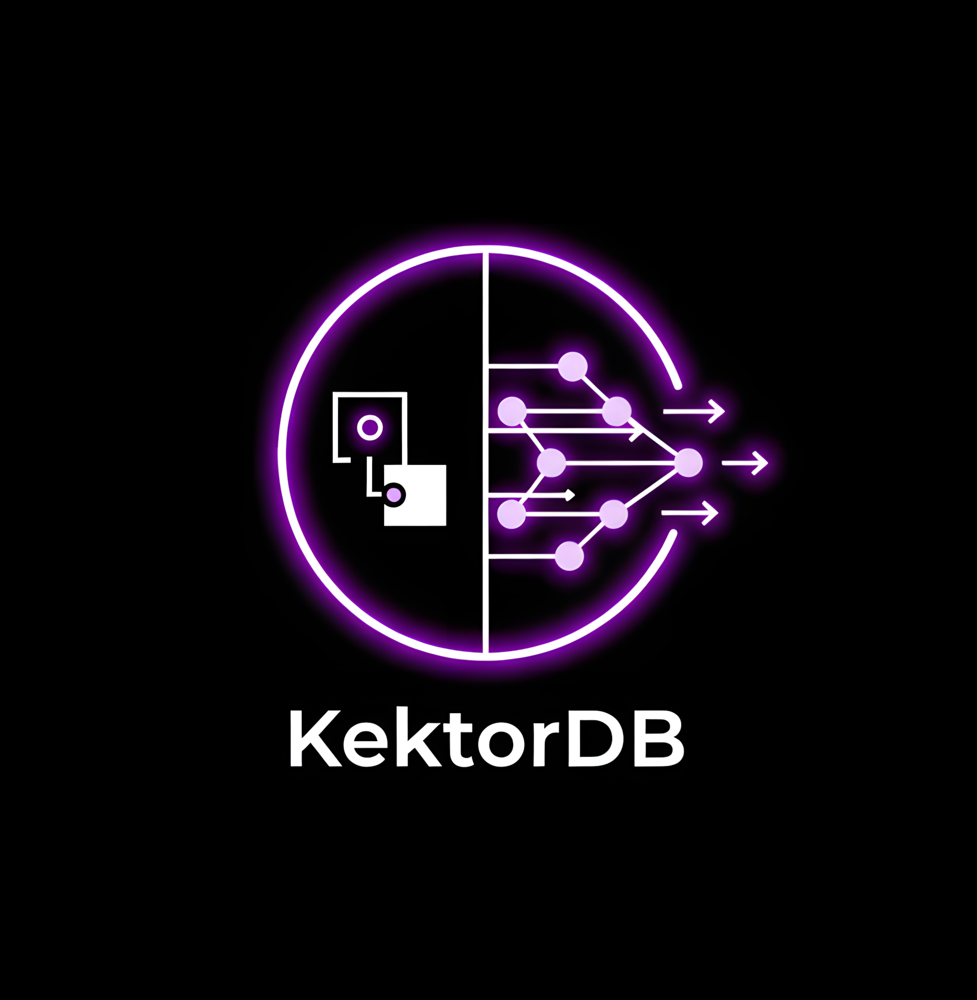
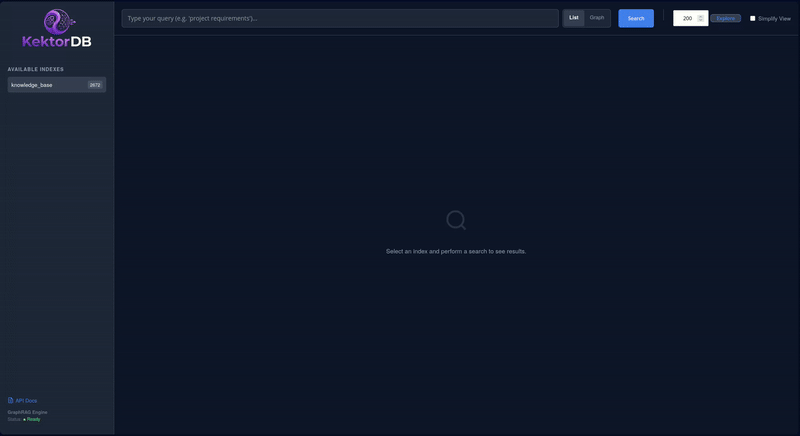
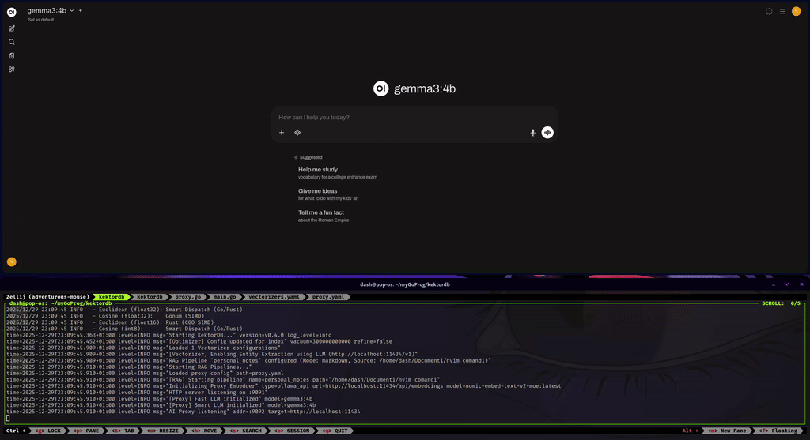
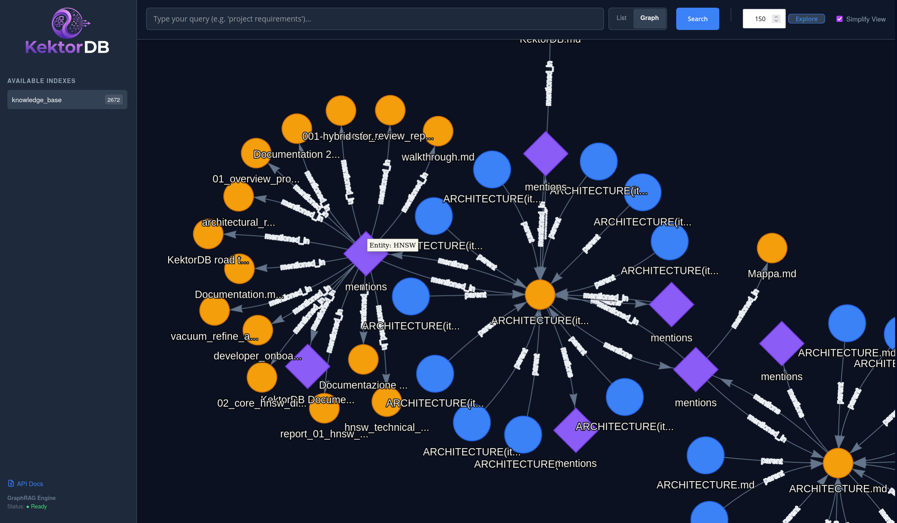

# KektorDB

*The cognitive memory layer for AI agents.*

<p align="center">
  
</p>

[](https://github.com/sponsors/sanonone)
[](https://ko-fi.com/sanon)
[](https://pkg.go.dev/github.com/sanonone/kektordb)
[](https://badge.fury.io/py/kektordb-client)
[](https://opensource.org/licenses/Apache-2.0)

<p align="center">
  <a href="DOCUMENTATION.md">📚 Documentation</a> •
  <a href="CONTRIBUTING.md">🤝 Contributing</a> •
  <a href="docs/guides/zero_code_rag.md">🤖 RAG Open WebUI Guide</a>
</p>

[English](README.md) | [Italiano](README.it.md)

> [!TIP]
> **Docker Support:** Prefer containers? A `Dockerfile` is included in the root for building your own images.

KektorDB is an **in-memory memory system for AI applications** that combines high-performance vector search with a temporal knowledge graph. It stores information while understanding it—tracking importance, relationships, and evolution over time. A built-in cognitive engine (Gardener) automatically consolidates memories, detects contradictions, and lets irrelevant information fade away through time-decay.

> *Built for developers building AI agents, RAG systems, and knowledge-intensive applications.*

<p align="center">
  
</p>

---

## What is KektorDB?

KektorDB is an **AI memory system** that combines two complementary engines:

1. **High-performance vector search (HNSW)** for semantic similarity—finds things that *mean* the same, not just exact matches.
2. **Temporal knowledge graph** for structured relationships—understands *how things connect* and *how knowledge evolves*.

**Traditional databases store data.** They hold facts without understanding their context, importance, or relationships. You query them, and they return what's stored. Simple, but limited.

**KektorDB thinks while it stores.** It tracks what's important versus forgotten, detects contradictions, and helps your AI retrieve the *right* information at the *right* time.

### Built for AI Engineers

If you're building:
- **AI Agents** that need persistent, self-organizing memory
- **RAG Systems** that should understand context and importance
- **Multi-Agent Systems** with shared knowledge
- **Personal AI Assistants** that learn over time

...then KektorDB is designed for you.

### But Still a Powerful Engine

Under the hood, you get proven database primitives:
- **HNSW** for high-performance vector similarity search
- **Hybrid Search** combining vector + BM25 keyword matching
- **Memory-efficient quantization** (Int8, Float16) to fit more in RAM
- **Graph traversal** for N-hop context retrieval

These are tools. The product is an AI that *understands* your data.

---

## Use Cases

### 1. AI Agent Memory (Primary)

Give your AI agent a persistent, self-organizing memory that understands relevance.

*Scenario:* Building an AI assistant that should remember user preferences, past conversations, and build knowledge over time.

*Solution:* Use sessions to track conversations. Let the Gardener extract facts and detect contradictions. Enable memory decay so old irrelevant information fades naturally.

*Benefit:* Users feel like they're talking to someone who actually remembers them.

### 2. Multi-Agent Shared Memory

Enable multiple AI agents to share knowledge and learn from each other.

*Scenario:* Multiple specialized agents (research, coding, writing) that need to share context and transfer learned information.

*Solution:* Use MCP or direct API to share memories between agent indexes. KektorDB tracks knowledge provenance and helps resolve conflicts.

*Benefit:* Agents stop repeating each other's mistakes.

### 3. RAG with Memory

Go beyond "retrieve and inject"—build RAG that actually understands relevance.

*Scenario:* Your RAG system keeps retrieving technically similar but contextually wrong documents.

*Solution:* Enable graph-based retrieval to follow semantic relationships. Use adaptive context expansion. Let the Gardener highlight gaps in knowledge.

*Benefit:* Higher recall, lower hallucination risk.

### 4. Embedded Vector Search (Go)

High-performance vector search embedded in your Go application without operational overhead.

*Scenario:* Implementing "Related Products" or "Semantic Search" in a Go backend.

*Solution:* `import "github.com/sanonone/kektordb/pkg/engine"` to run the DB in-process.

*Benefit:* Zero deployment complexity. The DB scales with your app.

---

## Key Differentiators

### Memory That Manages Itself

The **Gardener** is a background process that continuously analyzes your data:

- **Consolidation**: Merges duplicate information, strengthens frequently-used memories
- **Contradiction Detection**: Flags when new information conflicts with established facts
- **Knowledge Gap Analysis**: Identifies what's missing for complete understanding
- **Forgetting**: Naturally deprioritizes unused information

### Time-Aware Memory

Unlike static databases, KektorDB understands *when* information matters:

- **Decay**: Memories fade naturally if not reinforced
- **Reinforcement**: Retrieving a memory makes it more prominent
- **Temporal Graph**: Query the state of knowledge at any point in time
- **Core Facts**: Pin essential facts to prevent them from ever fading

### User-Aware Responses

KektorDB builds and maintains **user profiles**:

- Communication style and language preferences
- Expertise areas and known knowledge
- Stated preferences versus observed behavior
- Resolution of conflicting self-reported information

### Relationships as First-Class Citizens

The knowledge graph isn't an afterthought—it's core:

- Automatic entity extraction from documents
- Semantic linking of related concepts
- N-hop traversal for context discovery
- Weighted property graphs with timestamps

### Native MCP Support

KektorDB speaks the **Model Context Protocol** natively. Connect Claude Desktop or any MCP client directly.

**Memory Tools:** `save_memory`, `recall_memory`, `scoped_recall`, `adaptive_retrieve`

**Graph Tools:** `create_entity`, `connect_entities`, `explore_connections`, `find_connection`

**Cognitive Tools:** `start_session`, `end_session`, `get_user_profile`, `check_subconscious`, `resolve_conflict`, `ask_meta_question`

**Utility:** `transfer_memory`, `unpin_memory`, `filter_vectors`

---

## Zero-Code RAG (Open WebUI Integration)

<p align="center">
  
</p>

KektorDB can function as a **smart middleware** between your Chat UI and your LLM. It intercepts requests, performs retrieval, and injects context automatically.

**Architecture:**
`Open WebUI` -> `KektorDB Proxy (9092)` -> `Ollama / LocalAI (11434)`

**How to set it up:**

1.  **Configure `vectorizers.yaml`** to point to your documents and enable Entity Extraction.
2.  **Configure `proxy.yaml`** to point to your Local LLM (Ollama) or OpenAI.
3.  **Run KektorDB** with the proxy enabled:
    ```bash
    ./kektordb -vectorizers-config='vectorizers.yaml' -enable-proxy -proxy-config='proxy.yaml'
    ```
4.  **Configure Open WebUI:**
    *   **Base URL:** `http://localhost:9092/v1`
    *   **API Key:** `kektor` (or any string).
5.  **Chat:** Just ask questions about your documents. KektorDB handles the rest.

👉 **[Read the Full Guide: Building a Fast RAG System with Open WebUI](docs/guides/zero_code_rag.md)**

---

## ✨ Core Features

### Cognitive & Agentic Capabilities
*   **Cognitive Engine (Gardener):** A background daemon that performs cross-detector confidence validation. It analyzes the graph for contradictions, tracks user profiles, models knowledge evolution, and resolves conflicts using LLMs.
*   **Core Fact Extraction:** The Gardener automatically extracts immutable facts from user interactions (name, profession, preferences) and creates pinned memory nodes with `type="core_fact"` for persistent, fast retrieval without time-decay.
*   **Adaptive Retrieval:** A sophisticated RAG pipeline that uses graph-aware dynamically expanded context, retrieving seed chunks and automatically following semantic neighbors up to a budget constraint.
*   **Query Rewriting (CQR):** Automatically rewrites user questions based on chat history to solve the "Memory Problem".
*   **Grounded HyDe:** Generates grounded hypothetical answers using real data fragments to improve semantic recall for vague queries.
*   **Context Compression ("Caveman Mode"):** Safe lexical compression that reduces token count by 20-35% for LLM context while preserving semantic meaning. Removes safe stopwords (articles, prepositions) but strictly preserves negations and logical operators (not, and, or, but, if).
*   **EventBus:** Integrated pub/sub system for real-time reactivity to graph and vector operations, with Server-Sent Events (SSE) support.

### Performance & Engineering
*   **HNSW Engine:** Custom implementation optimized for high-concurrency reading.
*   **Hybrid Search:** Combines Vector Similarity + BM25 (Keyword) + Metadata Filtering.
*   **Memory Efficiency:** Supports **Int8 Quantization** (75% RAM savings) with zero-shot auto-training and **Float16**.
*   **Maintenance & Optimization:**
    *   **Vacuum:** A background process that cleans up deleted nodes to reclaim memory and repair graph connections.
    *   **Refine:** An ongoing optimization that re-evaluates graph connections to improve search quality (recall) over time.
*   **AI Gateway & Middleware:** Acts as a smart proxy for OpenAI/Ollama compatible clients. Features **Semantic Caching** to serve instant responses for recurring queries and a **Semantic Firewall** to block malicious prompts based on vector similarity or explicit deny lists.
*   **Lazy AOF Writer:** Optimized write performance with batched flushing (10-100x throughput improvement) while maintaining durability.
*   **Vision Support:** Process images and PDFs with OCR capabilities using Vision LLM integration.
*   **Persistence:** Hybrid **AOF + Snapshot** ensures durability.
*   **Observability:** Prometheus metrics (`/metrics`), structured logging, and Go pprof profiling endpoints.
*   **Dual Mode:** Run as a standalone **REST Server** or as a **Go Library**.

### Semantic Graph Engine
*   **Automated Entity Extraction:** Uses a local LLM to identify concepts (People, Projects, Tech) during ingestion and links related documents together.
*   **Weighted & Property Graphs:** Supports "Rich Edges" with attributes (weights, arbitrary properties) to enable complex recommendation and ranking algorithms.
*   **Temporal Graph (Time Travel):** Every relationship is versioned. Soft delete support allows querying the graph status at any point in the past.
*   **Memory Decay & Reinforcement:** Unifies short and long-term memory. Nodes naturally decay in relevance if not accessed, and are reinforced upon retrieval. Features pinned nodes capability.
*   **Bi-directional Navigation:** Automatic management of incoming edges to enable O(1) retrieval of "who points to node X", powering efficient graph traversal.
*   **Graph Entities:** Support for nodes without vectors to represent abstract entities like "Users", "Sessions", or "Proxy Agents" within the same graph structure.
*   **Graph Traversal:** Search traverses any relationship type (like `prev`, `next`, `parent`, `mentions`) to provide a holistic context window.
*   **Graph Filtering:** Combine vector search with graph topology filters (e.g., "search only children of Doc X"), powered by Roaring Bitmaps.
*   **Path Finding (FindPath):** Discover shortest paths between any two nodes using bidirectional BFS. Supports time travel queries.
*   **Node Search:** Perform pure metadata filtering without vector similarity.

<p align="center">
  
  <br>
  <em>Visualizing semantic connections between documents via extracted entities.</em>
</p>

### Model Context Protocol (MCP) Support
KektorDB functions as a full **Cognitive Memory Server** under the [Model Context Protocol](https://modelcontextprotocol.io/). This allows LLMs (like Claude Desktop) to use KektorDB as a long-term, self-organizing memory store directly.

*   **How to run:**
    ```bash
    ./kektordb --mcp
    ```
*   **Integration:** Add KektorDB to your MCP client configuration using the `--mcp` flag.

---

### Embedded Dashboard
Available at `http://localhost:9091/ui/`.
*   **Graph Explorer:** Visualize your knowledge graph with a force-directed layout.
*   **Search Debugger:** Test your queries and see exactly why a document was retrieved.

---

## Installation

### As a Server (Docker)

```bash
docker run -p 9091:9091 -p 9092:9092 -v $(pwd)/data:/data sanonone/kektordb:latest
```

### As a Server (Binary)
Download the pre-compiled binary from the [Releases page](https://github.com/sanonone/kektordb/releases).

```bash
# Linux/macOS
./kektordb

# With custom options
./kektordb -http-addr :9091 -save "30 500" -log-level debug
```

**Command-line flags:**
*   `-http-addr`: HTTP server address (default: `:9091`)
*   `-aof-path`: Path to persistence file (default: `kektordb.aof`)
*   `-save`: Auto-snapshot policy `"seconds changes"` (default: `"60 1000"`, empty to disable)
*   `-auth-token`: API authentication token
*   `-log-level`: Logging level (`debug`, `info`, `warn`, `error`)
*   `-enable-proxy`: Enable AI Gateway/Proxy
*   `-proxy-config`: Path to proxy configuration file
*   `-vectorizers-config`: Path to vectorizers configuration file
*   `-mcp`: Run as MCP Server (Stdio)

> **Compatibility Note:** All development and testing were performed on **Linux (x86_64)**. Pure Go builds are expected to work on Windows/Mac/ARM.

---

## 🚀 Quick Start (Python)

This example demonstrates building an **AI Agent with Memory** using sessions and cognitive features.

1.  **Install Client:**
    ```bash
    pip install kektordb-client sentence-transformers
    ```

2.  **Run the script:**

    ```python
    from kektordb_client import KektorDBClient
    from kektordb_client.cognitive import CognitiveSession

    # 1. Initialize
    client = KektorDBClient(port=9091)
    index = "agent_memory"

    # 2. Create index with memory enabled (30 day half-life)
    try:
        client.delete_index(index)
    except:
        pass
    client.vcreate(index, metric="cosine", text_language="english")

    # 3. Start a session (e.g., user conversation)
    with CognitiveSession(client, index, user_id="user_123") as session:
        # Save memories linked to this conversation
        session.save_memory(
            "User's name is Marco and he prefers concise answers",
            layer="episodic",
            tags=["user_preference"]
        )
        session.save_memory(
            "Marco is working on a Go project called KektorDB",
            layer="semantic",
            tags=["project", "go"]
        )
        session.save_memory(
            "Marco asked how to implement RAG. Explained vector search + graph traversal.",
            layer="episodic"
        )

    # 4. Later: Retrieve user profile
    profile = client.get_user_profile("user_123", index)
    print(f"Communication style: {profile.get('communication_style', 'N/A')}")
    print(f"Expertise areas: {profile.get('expertise_areas', [])}")

    # 5. Search memories
    results = client.vsearch(
        index,
        query_vector=[0.1, 0.2, 0.3, 0.4],  # Embed your query
        k=3,
        filter_str="tags ? 'project'"
    )
    print(f"Found {len(results)} relevant memories")
    ```

👉 **[Read the Full Documentation](DOCUMENTATION.md)** for all available endpoints and features.

---

### 🦜 Integration with LangChain

KektorDB includes a built-in wrapper for **LangChain Python**, allowing you to plug it directly into your existing AI pipelines.

```python
from kektordb_client.langchain import KektorVectorStore
```

---

## Benchmarks

Benchmarks were performed on a local Linux machine (Consumer Hardware, Intel i5-12500). The comparison runs against **Qdrant** and **ChromaDB** (via Docker with host networking) to ensure a fair baseline.

| Database | NLP QPS | Vision QPS | Recall@10 |
| :--- | :--- | :--- | :--- |
| **KektorDB** | **1073** | **881** | 0.97 |
| Qdrant | 848 | 845 | 0.97 |
| ChromaDB | 802 | 735 | 0.96 |

> *Note: KektorDB is optimized for embedded, single-node scenarios. For billion-scale distributed deployments, consider specialized solutions.*

[Full Benchmark Report](BENCHMARKS.md)

---

## 🛣️ Roadmap

### Released in v0.5.0 ✅
*   [x] **Zero-Copy mmap Arena:** Vector data stored in memory-mapped files, breaking the RAM limit.
*   [x] **Cognitive Engine (Gardener):** Background daemon for knowledge graph conflict resolution and user profiling.
*   [x] **Core Fact Extraction:** Automatic extraction of immutable user facts with pinned nodes.
*   [x] **Context Compression:** Safe lexical compression reducing LLM tokens by 20-35%.
*   [x] **TypeScript Client:** Official Node.js/TypeScript SDK.

### Planned (Short Term)
*   [x] **Graph Filtering:** Combine vector search with graph topology filters (Roaring Bitmaps).
*   [x] **Property Graphs:** Support for "Rich Edges" with attributes and timestamps.
*   [ ] **Native Backup/Restore:** Simple API to snapshot data to S3/MinIO/Local.
*   [ ] **SIMD/AVX Optimizations:** Extending pure Go Assembly to more distance metrics.
*   [x] **RBAC & Security:** Role-Based Access Control for multi-tenant apps.

> **Want to influence the roadmap?** [Open an Issue](https://github.com/sanonone/kektordb/issues) or vote on existing ones!

---

## 🛑 Current Limitations (v0.5.1)
*   **Single Node:** KektorDB does not currently support clustering. It scales vertically within the limits of the machine's resources.

---

### ⚠️ Project Status & Development Philosophy

While the ambition is high, the development pace depends on available free time and community contributions. The roadmap represents the **vision** for the project, but priorities may shift based on user feedback and stability requirements.

If you like the vision and want to speed up the process, **Pull Requests are highly welcome!**

---

## 🤝 Contributing

If you spot race conditions, missed optimizations, or unidiomatic Go patterns, **please open an Issue or a PR**.

👉 **[Read more](CONTRIBUTING.md)**

---

### License

Licensed under the Apache 2.0 License. See the `LICENSE` file for details.

---

## ☕ Support the Project

If you find this tool useful for your local RAG setup or your Go applications, please consider supporting the development.

Your support helps me dedicate more time to maintenance, new features, and documentation.

<a href="https://ko-fi.com/sanon">
  
</a>
