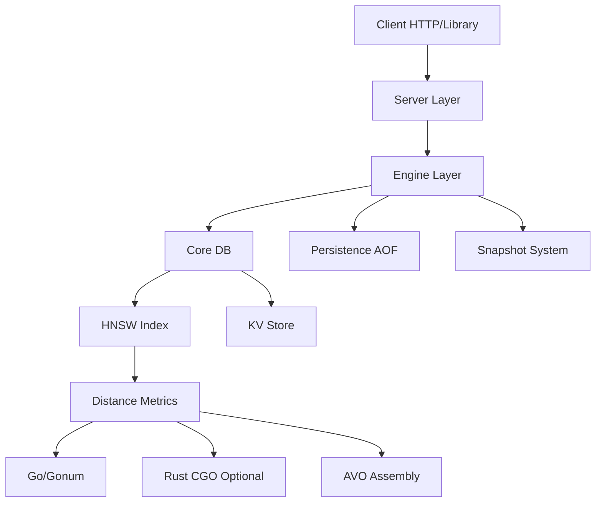

# KektorDB 

<p align="center">
  
</p>

[](https://pkg.go.dev/github.com/sanonone/kektordb)
[](https://badge.fury.io/py/kektordb-client)
[](https://opensource.org/licenses/Apache-2.0)

[English](README.md) | [Italiano](README.it.md)

> [!TIP]
> **Docker Support:** Prefer containers? A `Dockerfile` is included in the root for building your own images.


**KektorDB is an in-memory vector and Key-Value database built in Go. It implements an HNSW engine for vector search, hybrid search with BM25 ranking, metadata filtering, and a JSON-based REST API.**

### Motivation and Philosophy

This project began as a personal learning endeavor to dive deep into the internals of database systems. The goal was to build a **self-contained and dependency-free** search engine, aiming for the architectural simplicity of the **"SQLite of Vector DBs"**.

KektorDB runs as a standalone server or can be imported as an embeddable Go library (`pkg/engine`), offering a flexible solution for developers who need local vector search without managing complex infrastructure.

---

### ✨ Core Features

*   **Custom HNSW Engine:** A from-scratch implementation of the HNSW algorithm with heuristic neighbor selection for graph quality.
*   **Hybrid Search Engine:**
    *   **Full-Text Search:** Built-in text analysis (tokenization/stemming for English and Italian) and inverted index.
    *   **BM25 Ranking:** Text results are ranked using the standard BM25 algorithm.
    *   **Score Fusion:** Combines vector and text scores via a configurable `alpha` parameter.
*   **Automatic Synchronization (Vectorizer):** A background service that watches data sources (filesystem), generates embeddings via external APIs (e.g., Ollama), and updates the index automatically.
*   **Metadata Filtering:** Support for pre-filtering on metadata using equality, range (`price<100`), and boolean logic (`AND`/`OR`). 
*   **Vector Compression:**
    *   **Float16:** Reduces Euclidean index size by **50%**.
    *   **Int8:** Quantizes Cosine indexes by **75%**.
*   **API:**
    *   A JSON REST API supporting batch operations and async task management. 
    *   Official clients for **Python** and **Go**.
*   **Persistence:** A hybrid **AOF + Snapshot** system ensures durability across restarts. 
*   **Maintenance & Optimization:**
    *   **Vacuum:** A background process that cleans up deleted nodes to reclaim memory and repair graph connections.
    *   **Refine:** An ongoing optimization that re-evaluates graph connections to improve search quality (recall) over time. 
*   **Dual Compute Engine:**
    *   **Standard Build:** Uses pure Go with `gonum` assembly for portability.
    *   **Performance Build:** Optional (`-tags rust`) build that links a Rust library via CGO to leverage specific SIMD instructions. 

---

### Architecture 

1.  **Core (`pkg/core`):** Contains the raw in-memory data structures (HNSW graph, KV store, Inverted Index). It handles data logic but is unaware of the file system or network.
2.  **Engine (`pkg/engine`):** It manages the Core, handles data persistence (AOF writing/replaying, Snapshots), and coordinates background maintenance tasks. This is the entry point for embedded usage.
3.  **Server (`internal/server`):** An HTTP wrapper around the Engine. It provides the REST API, Vectorizer background workers, and task management.



---

### Preliminary Benchmarks

Benchmarks were performed on a local Linux machine (Consumer Hardware, Intel i5-12500). The comparison runs against **Qdrant** and **ChromaDB** (via Docker with host networking) to ensure a fair baseline.

> **Disclaimer:** Benchmarking databases fairly is notoriously difficult. While I have made every effort to configure all engines equitably (e.g., removing network overhead), I am not an expert in configuring Qdrant or ChromaDB, and there may be optimizations I missed. Please treat these numbers as a **directional indicator** of KektorDB's potential in a specific local scenario (single-node, read-heavy), rather than a definitive scientific conclusion.

#### 1. NLP Workload (GloVe-100d, Cosine)
*400k vectors, float32 precision.*
KektorDB leverages optimized Go Assembly (Gonum) for Cosine similarity. In this specific setup, it shows very high throughput.

| Database | Recall@10 | **QPS (Queries/sec)** | Indexing Time (s) |
| :--- | :--- | :--- | :--- |
| **KektorDB** | 0.971 | **974** | 127s |
| Qdrant | 0.970 | 807 | **34s** |
| ChromaDB | 0.955 | 761 | 53s |

#### 2. Computer Vision Workload (SIFT-1M, Euclidean)
*1 Million vectors, float32 precision.*
KektorDB uses a hybrid Go/Rust engine (`-tags rust`) for this test. Despite the CGO overhead for 128d vectors, performance is competitive with native C++/Rust engines.

| Database | Recall@10 | **QPS (Queries/sec)** | Indexing Time (s) |
| :--- | :--- | :--- | :--- |
| **KektorDB** | 0.990 | 753 | 634s |
| Qdrant | 0.998 | **852** | **89s** |
| ChromaDB | 0.994 | 752 | 210s |

> *Note on Indexing Speed:* KektorDB is currently slower at ingestion compared to mature engines. This is partly because it builds the full queryable graph immediately upon insertion, but mostly due to the current single-graph architecture. **Optimizing bulk ingestion speed is the top priority for the next major release.**

#### Memory Efficiency (Compression & Quantization)
KektorDB offers significant memory savings through quantization and compression, allowing you to fit larger datasets into RAM with minimal impact on performance or recall.

| Scenario | Config | Memory Impact | QPS | Recall |
| :--- | :--- | :--- | :--- | :--- |
| **NLP (GloVe-100d)** | Float32 | 100% (Baseline) | ~974 | 0.971 |
| | **Int8** | **~25%** | ~767 | 0.908 |
| **Vision (SIFT-1M)** | Float32 | 100% (Baseline) | ~753 | 0.990 |
| | **Float16** | **~50%** | **~785** | 0.980 |

*(The "Smart Dispatch" logic in the Rust-accelerated build automatically selects the best implementation—Go, Gonum, or Rust—for each operation based on vector dimensions. The pure Go `float16` and `int8` versions serve as portable fallbacks.)*

[Benchmark](BENCHMARKS.md)

---

### Installation

Download the pre-compiled binary from the [Releases page](https://github.com/sanonone/kektordb/releases).

```bash
# Linux/macOS
./kektordb
```

> **Compatibility Note:** All development and testing were performed on **Linux (x86_64)**.
> *   **Pure Go Builds:** Expected to run seamlessly on Windows, macOS (Intel/M1), and ARM, though not manually verified yet.
> *   **Rust-Accelerated Builds:** Leverage CGO and specific SIMD instructions. These builds have currently **only been verified on Linux**.

### Use Cases & When to Use

KektorDB follows the "SQLite philosophy" but for vectors. It is not designed to replace distributed clusters (like Qdrant Cloud or Milvus) for petabyte-scale data.

**✅ Use KektorDB when:**
*   You need a **local, embedded** search engine for a Go or Python application.
*   You want to keep your architecture simple (no extra containers/services required).
*   Your dataset fits in RAM (e.g., < 5M vectors on a standard server).
*   You are building "Edge AI" or privacy-first applications where data shouldn't leave the machine.

**❌ Consider other options when:**
*   You need distributed storage across multiple nodes (Sharding/Replication).
*   Your dataset is massive (100M+ vectors) and requires disk-based indexing.

### 🦜 Integration with LangChain

KektorDB includes a built-in wrapper for **LangChain Python**, allowing you to plug it directly into your existing AI pipelines.

```python
from kektordb_client.langchain import KektorVectorStore
# See clients/python/README.md for full details
```

### 🚀 Quick Start (Python)

This example demonstrates a complete workflow: creating multiple indexes, batch-inserting data with metadata, and performing a powerful hybrid search.

1.  **Run the KektorDB Server:**
    ```bash
    # Download the latest binary from the Releases page
    ./kektordb -http-addr=":9091"
    ```

2.  **Install the Python Client and Dependencies:**
    ```bash
    pip install kektordb-client sentence-transformers
    ```

3.  **Use KektorDB in your Python script:**

    ```python
    from kektordb_client import KektorDBClient, APIError
    from sentence_transformers import SentenceTransformer

    # 1. Initialize client and embedding model
    client = KektorDBClient(port=9091)
    model = SentenceTransformer('all-MiniLM-L6-v2') 
    index_name = "quickstart_index"

    # 2. Create a fresh index for the demo
    try:
        client.delete_index(index_name)
        print(f"Removed old index '{index_name}'.")
    except APIError:
        pass # Index didn't exist, which is fine.

    client.vcreate(
        index_name, 
        metric="cosine", 
        text_language="english"
    )
    print(f"Index '{index_name}' created.")
    
    # 3. Prepare and index some documents in a single batch
    documents = [
        {"id": "doc_go", "text": "Go is a language designed at Google for efficient software.", "year": 2012},
        {"id": "doc_rust", "text": "Rust is a language focused on safety and concurrency.", "year": 2015},
        {"id": "doc_python", "text": "Python is a high-level, general-purpose programming language. Its design philosophy emphasizes code readability.", "year": 1991},
    ]
    
    batch_payload = []
    for doc in documents:
        batch_payload.append({
            "id": doc["id"],
            "vector": model.encode(doc["text"]).tolist(),
            "metadata": {"content": doc["text"], "year": doc["year"]}
        })
    client.vadd_batch(index_name, batch_payload)
    print(f"{len(batch_payload)} documents indexed.")
    
    
    # 4. Perform a hybrid search
    query = "a safe and concurrent language"
    print(f"\nSearching for: '{query}'")

    results = client.vsearch(
        index_name=index_name,
        k=1,
        query_vector=model.encode(query).tolist(),
        # Find documents containing "language" but only those after 2010
        filter_str='CONTAINS(content, "language") AND year > 2010',
        alpha=0.7 # Give more weight to vector similarity
    )

    print(f"Found results: {results}")

    # 5. Verify the result
    if results and results[0] == "doc_rust":
        print("\nQuick Start successful! The most relevant document was found correctly.")
    else:
        print("\nQuick Start failed. The expected document was not the top result.")

    # 6. Retrieve the full data for the top result
    if results:
        top_result_data = client.vget(index_name, results[0])
        print("\n--- Top Result Data ---")
        print(f"ID: {top_result_data.get('id')}")
        print(f"Metadata: {top_result_data.get('metadata')}")
        print("-----------------------")
    ```
**Note for macOS users:** The pre-compiled binaries for macOS utilize the pure Go compute engine for maximum compatibility. For performance-critical use cases requiring SIMD acceleration on macOS, we recommend building from source locally: `make build-rust-native && go build -tags rust ./cmd/kektordb`

---

### Using as an Embedded Go Library

One of KektorDB's main goals is to be easily embeddable. You can import the engine directly into your Go application, removing the need for external services or containers.

```bash
go get github.com/sanonone/kektordb

package main

import (
	"fmt"
	"github.com/sanonone/kektordb/pkg/core/distance"
	"github.com/sanonone/kektordb/pkg/engine"
)

func main() {
	// 1. Initialize the Engine (handles persistence automatically)
	opts := engine.DefaultOptions("./kektor_data")
	db, err := engine.Open(opts)
	if err != nil { panic(err) }
	defer db.Close()

	// 2. Create Index
	db.VCreate("products", distance.Cosine, 16, 200, distance.Float32, "english")

	// 3. Add Data
	db.VAdd("products", "p1", []float32{0.1, 0.2}, map[string]any{"category": "electronics"})

	// 4. Search
	results, _ := db.VSearch("products", []float32{0.1, 0.2}, 10, "category=electronics", 100, 0.5)
	fmt.Println("Found IDs:", results)
}
```
---

### API Reference

#### Key-Value Store
- `GET /kv/{key}`: Retrieves a value.
- `POST /kv/{key}`: Sets a value. Body: `{"value": "..."}`.
- `DELETE /kv/{key}`: Deletes a key.

#### Index Management
- `GET /vector/indexes`: Lists all indexes.
- `GET /vector/indexes/{name}`: Gets detailed info for a single index.
- `DELETE /vector/indexes/{name}`: Deletes an index.

#### Vector Actions (RPC-Style)
- `POST /vector/actions/create`: Creates a new vector index.
  - Body: `{"index_name": "...", "metric": "...", "precision": "...", "text_language": "...", "m": ..., "ef_construction": ...}`
- `POST /vector/actions/add`: Adds a single vector.
  - Body: `{"index_name": "...", "id": "...", "vector": [...], "metadata": {...}}`
- `POST /vector/actions/add-batch`: Adds multiple vectors.
  - Body: `{"index_name": "...", "vectors": [{"id": ..., "vector": ...}, ...]}`
- `POST /vector/actions/import`: High-speed bulk loading (bypasses AOF for speed).
  - Body: `{"index_name": "...", "vectors": [...]}`
- `POST /vector/actions/search`: Performs a hybrid vector search.
  - Body: `{"index_name": "...", "k": ..., "query_vector": [...], "filter": "...", "ef_search": ..., "alpha": ...}`
- `POST /vector/actions/delete_vector`: Deletes a single vector.
  - Body: `{"index_name": "...", "id": "..."}`
- `POST /vector/actions/get-vectors`: Retrieves data for multiple vectors by ID.
  - Body: `{"index_name": "...", "ids": ["...", "..."]}`
- `POST /vector/actions/compress`: Asynchronously compresses an index.
  - Body: `{"index_name": "...", "precision": "..."}`

#### Data Retrieval
- `GET /vector/indexes/{name}/vectors/{id}`: Retrieves data for a single vector.

#### System
- `POST /system/save`: Triggers a database snapshot.
- `POST /system/aof-rewrite`: Triggers an asynchronous AOF compaction.
- `GET /system/tasks/{id}`: Gets the status of an asynchronous task.
- `GET /debug/pprof/*`: Exposes Go pprof profiling endpoints.

---

### Documentation

For a complete guide to all features and API endpoints, please see the **[Full Documentation](https://github.com/sanonone/kektordb/blob/main/DOCUMENTATION.md)**.

---

### 🛣️ Roadmap & Future Work

KektorDB is a young project under active development. Contributions are highly welcome!

#### **Near-Term Goals**

These are the highest priority features and improvements planned for upcoming releases:

*   **Advanced Filtering:** Replace Go maps with **Roaring Bitmaps** for lightning-fast metadata filtering and reduced memory usage.
*   **Graph Healing:** Implement a background worker to repair the HNSW graph after deletions, ensuring long-term index quality without full rebuilds.
*   **Native Snapshotting:** Improve the snapshot format to be more compact and faster to load (binary serialization optimization).
*   **Concurrency Polish:** Further optimize the locking strategy for mixed read/write workloads.

#### **Long-Term Vision (Exploratory Ideas)**

These are ambitious features that are being considered for the long-term evolution of the project.

*   **Disk-Based Indexes:** Explore mmap or disk-based graph traversal to support datasets larger than RAM.
*   **RAG Pipelines:** Built-in support for chunking and embedding PDF/Text files directly within the engine.
*   **Replication:** Simple primary-replica replication for high availability.

---

## Contributing

**KektorDB is a personal project born from a desire to learn the internals of vector databases.**

As the sole maintainer, I built this engine to explore CGO, SIMD, and low-level Go optimizations. I am proud of the performance achieved so far, but I know there is always a better way to write code.

If you spot race conditions, missed optimizations, or unidiomatic Go patterns, **please open an Issue or a PR**. I treat every contribution as a learning opportunity and I am looking for people who want to build this together.

### Areas for Contribution
The project is currently in `v0.2.2`. I would appreciate help with:

1.  **Core Optimization:** Reviewing the HNSW implementation and locking strategies.
2.  **Features:** Implementing Roaring Bitmaps or Graph Healing (see Roadmap).
3.  **Clients:** Making the Python/Go clients more idiomatic.
4.  **Testing:** Adding edge-case tests and fuzzing.

### Development Setup
1.  Fork the repository.
2.  Clone your fork.
3.  Run `make test` to ensure everything is working.
4.  Create a feature branch.
5.  Commit and open a **Pull Request**.

---

### License

Licensed under the Apache 2.0 License. See the `LICENSE` file for details.

