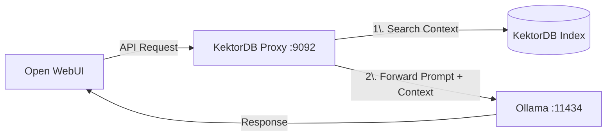
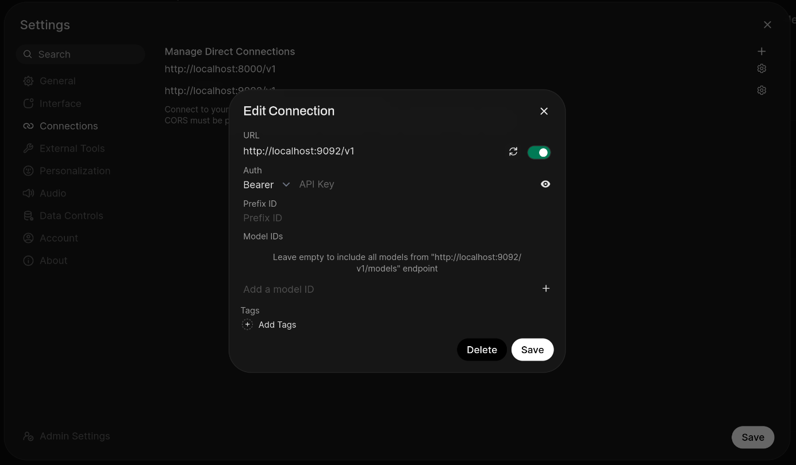

# Building a Zero-Code RAG System with Open WebUI

This guide shows you how to turn **KektorDB** into a transparent RAG middleware.
By the end of this tutorial, you will be able to chat with your local files using **Open WebUI** (or any OpenAI-compatible client) without writing a single line of Python code.

## Architecture

Instead of connecting Open WebUI directly to Ollama, we place KektorDB in the middle.



---

## Prerequisites

1.  **KektorDB** (v0.4.0+) installed.
2.  **Ollama** running locally on port `11434` (with `nomic-embed-text` and a chat model like `llama3` or `deepseek-r1` pulled).
3.  **Open WebUI** (or Chatbox, Cursor, etc.) installed.

---

## Step 1: Prepare Configuration

Create a folder for your project and add these two minimal configuration files.

### 1. `vectorizers.yaml` (The Ingestion Engine)
This tells KektorDB which folder to watch. It will automatically chunk and index any file you put there.

```yaml
vectorizers:
  - name: "my_knowledge_base"
    kektor_index: "docs_kb"
    schedule: "60s"
    
    # Where your files are located
    source:
      type: "filesystem"
      path: "./documents" 
      
    # Automatic Context Window (Prev/Next chunks)
    graph_enabled: true 
    
    # Entity Extraction
    # Connects documents that talk about the same topics
    graph_entity_extraction: true
    
    # Brain for extraction (Small model recommended)
    llm:
      base_url: "http://localhost:11434/v1"
      model: "gemma3:4b" # Fast & efficient
      temperature: 0.0

    # Model vision for analyzing images
    vision_llm:
      base_url: "http://localhost:11434/v1"
      model: "gemma3:4b" 
      temperature: 0.0
      max_tokens: 300 # description token limit

    # Embedding Model (Must match what you have in Ollama)
    embedder:
      type: "ollama_api"
      url: "http://localhost:11434/api/embeddings"
      model: "nomic-embed-text"
```

### 2. `proxy.yaml` (The AI Gateway)
This configures the proxy server that intercepts your chat messages.

```yaml
# Proxy listens on this port
port: ":9092"
# Forwards requests to this LLM
target_url: "http://localhost:11434"

# Embedder (Must match vectorizers.yaml)
embedder_type: "ollama_api"
embedder_url: "http://localhost:11434/api/embeddings"
embedder_model: "nomic-embed-text"

# Agentic Brains
# Fast LLM for Query Rewriting (Memory Fix)
fast_llm:
  base_url: "http://localhost:11434/v1"
  model: "qwen2.5:0.5b" 

# Smart LLM for HyDe (Reasoning)
llm:
  base_url: "http://localhost:11434/v1"
  model: "gemma3:4b" # Or llama3

# RAG Pipeline
rag_enabled: true
rag_index: "docs_kb"
rag_top_k: 6
rag_threshold: 0.7            # Lower threshold if hybrid true (0.45)
rag_use_graph: true           # Enables Entity Graph traversal
rag_use_hyde: true            # Enables Hypothetical Document Embeddings
rag_use_hybrid: false         # Hybrid Search
rag_hybrid_alpha: 0.9         # 90% Vector priority (Recommended)
```

---

## Step 2: Run KektorDB

Create a `documents` folder and put some files inside. Then start the server:

```bash
# Create data dirs
mkdir -p documents kektor_data

# Run KektorDB with both configs enabled
./kektordb -vectorizers-config="vectorizers.yaml" -enable-proxy -proxy-config="proxy.yaml"
```

You should see logs indicating that the **Vectorizer** is processing files and the **Proxy** is listening on `:9092`.

---

## Step 3: Configure Open WebUI

Now we need to tell Open WebUI to talk to KektorDB instead of talking directly to Ollama.

1.  Open **Open WebUI** in your browser.
2.  Go to **Settings** (Account Icon -> Settings) -> **Connections**.
3.  Under **OpenAI API**, add a new connection:

    *   **Base URL:** `http://localhost:9092/v1`
        *   *(Note: Important! Do not use 11434. Use the KektorDB Proxy port 9092)*.
    *   **API Key:** `kektor`
        *   *(Any string works unless you enabled auth in KektorDB)*.

4.  Click **Save/Verify**. You should see your Ollama models appear in the list (KektorDB forwards the model list request to Ollama).


*Set the Base URL to KektorDB Proxy (default :9092).*

---

## Step 4: Chat with your Data

1.  Select a model (e.g., `deepseek-r1`) in Open WebUI.
2.  Ask a question specifically related to the PDF/Markdown you placed in the `./documents` folder.

**Example:**
> *User:* "What is the refund policy mentioned in the documents?"

**What happens in the background:**
1.  **Memory Fix (CQR):** KektorDB intercepts the prompt. If the user asks "How do I install it?", it rewrites the query to "How do I install [Project Name]?" based on chat history.
2.  **Reasoning (HyDe):** It generates a hypothetical answer using the LLM to understand the *intent* beyond keywords.
3.  **Graph Retrieval:** It performs a vector search using the hypothetical answer, traversing the graph to find connected entities and context.
4.  **Injection:** It rewrites the prompt with the enriched context and forwards it to Ollama.


*KektorDB automatically injecting context into the chat.*

---

## Troubleshooting

*   **Models not loading?** Ensure `target_url` in `proxy.yaml` points to your running Ollama instance.
*   **"ID already exists" logs?** This is normal during startup/updates; the engine ensures idempotency.

---
