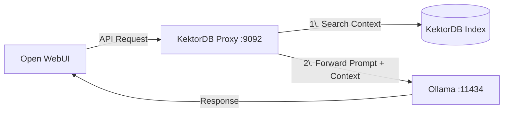

# Building a Zero-Code RAG System with Open WebUI

This guide shows you how to turn **KektorDB** into a transparent RAG middleware.
By the end of this tutorial, you will be able to chat with your local files using **Open WebUI** (or any OpenAI-compatible client) without writing a single line of Python code.

## Architecture

Instead of connecting Open WebUI directly to Ollama, we place KektorDB in the middle.



---

## Prerequisites

1.  **KektorDB** (v0.3.0+) installed.
2.  **Ollama** running locally on port `11434` (with `nomic-embed-text` and a chat model like `llama3` or `deepseek-r1` pulled).
3.  **Open WebUI** (or Chatbox, Cursor, etc.) installed.

---

## Step 1: Prepare Configuration

Create a folder for your project and add these two minimal configuration files.

### 1. `vectorizers.yaml` (The Ingestion Engine)
This tells KektorDB which folder to watch. It will automatically chunk and index any file you put there.

```yaml
vectorizers:
  - name: "my_knowledge_base"
    kektor_index: "docs_kb"
    schedule: "30s"
    
    # Where your files are located
    source:
      type: "filesystem"
      path: "./documents" 
      
    # Automatic Context Window (Prev/Next chunks)
    graph_enabled: true 

    # Embedding Model (Must match what you have in Ollama)
    embedder:
      type: "ollama_api"
      url: "http://localhost:11434/api/embeddings"
      model: "nomic-embed-text"
```

### 2. `proxy.yaml` (The AI Gateway)
This configures the proxy server that intercepts your chat messages.

```yaml
# Proxy listens on this port
port: ":9092"
# Forwards requests to this LLM
target_url: "http://localhost:11434"

# Embedding settings for the query (Must match vectorizers.yaml)
embedder_type: "ollama_api"
embedder_url: "http://localhost:11434/api/embeddings"
embedder_model: "nomic-embed-text"

# Enable RAG Injection
rag_enabled: true
rag_index: "docs_kb"  # Must match 'kektor_index' in vectorizers.yaml
rag_top_k: 3          # Inject top 3 relevant chunks
rag_use_graph: true   # Fetch surrounding context (prev/next) automatically
```

---

## Step 2: Run KektorDB

Create a `documents` folder and put some files inside. Then start the server:

```bash
# Create data dirs
mkdir -p documents kektor_data

# Run KektorDB with both configs enabled
./kektordb \
  -vectorizers-config vectorizers.yaml \
  -enable-proxy \
  -proxy-config proxy.yaml \
  -aof-path kektor_data/kektordb.aof
```

You should see logs indicating that the **Vectorizer** is processing files and the **Proxy** is listening on `:9092`.

---

## Step 3: Configure Open WebUI

Now we need to tell Open WebUI to talk to KektorDB instead of talking directly to Ollama.

1.  Open **Open WebUI** in your browser.
2.  Go to **Settings** (Account Icon -> Settings) -> **Connections**.
3.  Under **OpenAI API**, add a new connection:

    *   **Base URL:** `http://localhost:9092/v1`
        *   *(Note: Important! Do not use 11434. Use the KektorDB Proxy port 9092)*.
    *   **API Key:** `kektor`
        *   *(Any string works unless you enabled auth in KektorDB)*.

> **[IMAGE]** TODO
> *Screenshot of Open WebUI "Connections" settings page showing the URL `http://localhost:9092/v1` inserted into the OpenAI field.*

4.  Click **Save/Verify**. You should see your Ollama models appear in the list (KektorDB forwards the model list request to Ollama).

---

## Step 4: Chat with your Data

1.  Select a model (e.g., `deepseek-r1`) in Open WebUI.
2.  Ask a question specifically related to the PDF/Markdown you placed in the `./documents` folder.

**Example:**
> *User:* "What is the refund policy mentioned in the documents?"

**What happens in the background:**
1.  KektorDB intercepts the prompt.
2.  It finds the relevant chunk in your PDF.
3.  It fetches the previous and next sentences via the Graph Engine for full context.
4.  It rewrites the prompt: *"Context: [PDF Content]... Query: What is the refund policy?"*
5.  Ollama answers using that data.

> **[GIF/IMAGE]** TODO
> *A GIF showing the user typing a question about a private document and the LLM answering correctly.*

---

## Troubleshooting

*   **Models not loading?** Ensure `target_url` in `proxy.yaml` points to your running Ollama instance.
*   **"ID already exists" logs?** This is normal during startup/updates; the engine ensures idempotency.

---
